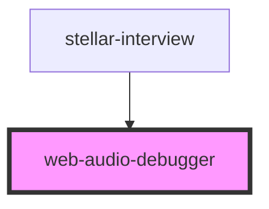

# web-audio-debugger

<!-- Auto Generated Below -->

## Properties

| Property | Attribute | Description | Type     | Default |
| -------- | --------- | ----------- | -------- | ------- |
| `count`  | `count`   |             | `number` | `50`    |

## Methods

### `addHistory(string: History) => Promise<void>`

#### Returns

Type: `Promise<void>`

## Dependencies

### Used by

 - [stellar-interview](../../media/interview)

### Graph

----------------------------------------------

*Built with [StencilJS](https://stenciljs.com/)*
