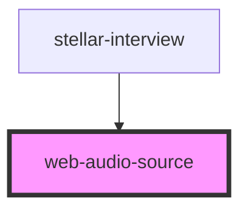

# web-audio-source

<!-- Auto Generated Below -->

## Properties

| Property        | Attribute       | Description | Type      | Default     |
| --------------- | --------------- | ----------- | --------- | ----------- |
| `effectsvolume` | `effectsvolume` |             | `number`  | `100`       |
| `inert`         | `inert`         |             | `boolean` | `false`     |
| `midichannel`   | `midichannel`   |             | `number`  | `1`         |
| `midikey`       | `midikey`       |             | `number`  | `0`         |
| `name`          | `name`          |             | `string`  | `undefined` |
| `playing`       | `playing`       |             | `boolean` | `false`     |
| `prepared`      | `prepared`      |             | `boolean` | `false`     |
| `src`           | `src`           |             | `string`  | `undefined` |

## Events

| Event    | Description | Type               |
| -------- | ----------- | ------------------ |
| `update` |             | `CustomEvent<any>` |

## Methods

### `assignBuffer(webAudio: any, buffer: any) => Promise<void>`

#### Returns

Type: `Promise<void>`

### `gain(place?: string) => Promise<GainNode>`

#### Returns

Type: `Promise<GainNode>`

### `getBuffer() => Promise<AudioBuffer>`

#### Returns

Type: `Promise<AudioBuffer>`

### `getDuration() => Promise<number>`

#### Returns

Type: `Promise<number>`

### `pause() => Promise<void>`

#### Returns

Type: `Promise<void>`

### `play() => Promise<void>`

#### Returns

Type: `Promise<void>`

### `prepare() => Promise<void>`

#### Returns

Type: `Promise<void>`

### `skipTo(time: any) => Promise<void>`

#### Returns

Type: `Promise<void>`

### `stop() => Promise<void>`

#### Returns

Type: `Promise<void>`

### `toggle() => Promise<void>`

#### Returns

Type: `Promise<void>`

### `webAudio() => Promise<HTMLElement>`

#### Returns

Type: `Promise<HTMLElement>`

## Dependencies

### Used by

 - [stellar-interview](../../media/interview)

### Graph

----------------------------------------------

*Built with [StencilJS](https://stenciljs.com/)*
