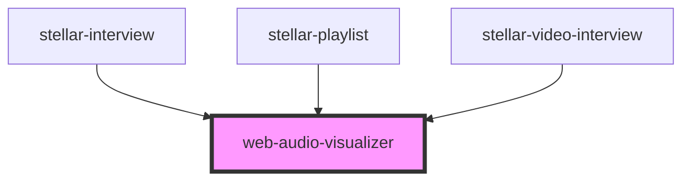

# web-audio-visualizer

<!-- Auto Generated Below -->

## Properties

| Property    | Attribute   | Description | Type           | Default       |
| ----------- | ----------- | ----------- | -------------- | ------------- |
| `_color`    | `_color`    |             | `any`          | `undefined`   |
| `analyser`  | --          |             | `AnalyserNode` | `undefined`   |
| `color`     | `color`     |             | `string`       | `"white"`     |
| `for`       | `for`       |             | `string`       | `"web_audio"` |
| `height`    | `height`    |             | `number`       | `1024`        |
| `renderer`  | --          |             | `AnalyserNode` | `undefined`   |
| `size`      | `size`      |             | `number`       | `1024`        |
| `smoothing` | `smoothing` |             | `number`       | `0.7`         |
| `type`      | `type`      |             | `string`       | `"wave"`      |
| `width`     | `width`     |             | `number`       | `1024`        |

## Methods

### `connect(context: AudioContext, destination?: any) => Promise<this>`

#### Returns

Type: `Promise<this>`

## Dependencies

### Used by

 - [stellar-interview](../../media/interview)
 - [stellar-playlist](../../media/playlist)
 - [stellar-video-interview](../../media/video-interview)

### Graph

----------------------------------------------

*Built with [StencilJS](https://stenciljs.com/)*
