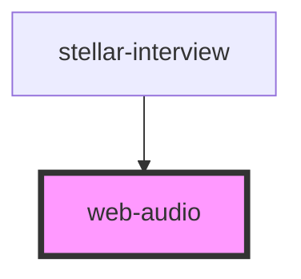

# web-audio

<!-- Auto Generated Below -->

## Properties

| Property   | Attribute | Description | Type      | Default       |
| ---------- | --------- | ----------- | --------- | ------------- |
| `autoplay` | --        |             | `Boolean` | `undefined`   |
| `midi`     | --        |             | `Boolean` | `false`       |
| `name`     | `name`    |             | `string`  | `"web_audio"` |

## Methods

### `connect_the_world() => Promise<boolean>`

#### Returns

Type: `Promise<boolean>`

### `get_context() => Promise<AudioContext>`

#### Returns

Type: `Promise<AudioContext>`

### `is_prepared() => Promise<Boolean>`

#### Returns

Type: `Promise<Boolean>`

### `source(name: any) => Promise<any>`

#### Returns

Type: `Promise<any>`

### `stop() => Promise<void>`

#### Returns

Type: `Promise<void>`

## Dependencies

### Used by

 - [stellar-interview](../../media/interview)

### Graph

----------------------------------------------

*Built with [StencilJS](https://stenciljs.com/)*
