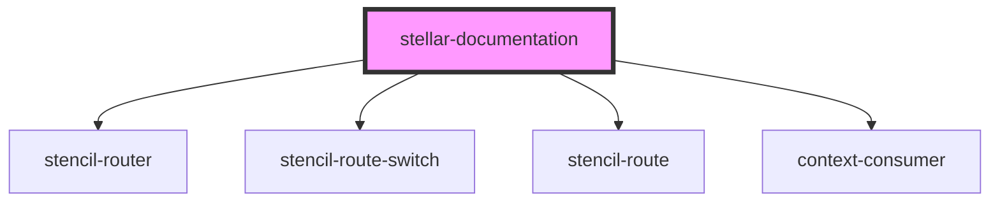

# stellar-docs

<!-- Auto Generated Below -->

## Properties

| Property             | Attribute            | Description | Type     | Default     |
| -------------------- | -------------------- | ----------- | -------- | ----------- |
| `collection_link`    | `collection_link`    |             | `string` | `undefined` |
| `coverage_link`      | `coverage_link`      |             | `string` | `undefined` |
| `documentation_link` | `documentation_link` |             | `string` | `undefined` |
| `package_link`       | `package_link`       |             | `string` | `undefined` |
| `stats_link`         | `stats_link`         |             | `string` | `undefined` |

## Dependencies

### Depends on

- stencil-router
- stencil-route-switch
- stencil-route
- context-consumer

### Graph

----------------------------------------------

*Built with [StencilJS](https://stenciljs.com/)*
