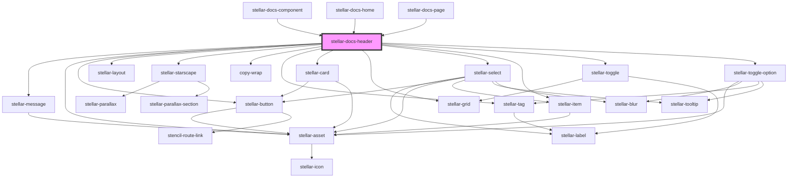

# stellar-docs-header

<!-- Auto Generated Below -->

## Properties

| Property     | Attribute    | Description | Type      | Default     |
| ------------ | ------------ | ----------- | --------- | ----------- |
| `complement` | `complement` |             | `string`  | `"indigo"`  |
| `invert`     | `invert`     |             | `boolean` | `false`     |
| `mark`       | `mark`       |             | `string`  | `undefined` |
| `max`        | `max`        |             | `number`  | `10`        |
| `theme`      | `theme`      |             | `string`  | `"red"`     |
| `value`      | `value`      |             | `number`  | `0`         |

## Dependencies

### Used by

 - [stellar-docs-component](../component)
 - [stellar-docs-home](../home)
 - [stellar-docs-page](../page)

### Depends on

- [stellar-message](../../ui/message)
- [stellar-asset](../../ui/asset)
- [stellar-button](../../forms/button)
- [stellar-layout](../../ui/layout)
- [stellar-starscape](../../helpers/starscape)
- [copy-wrap](../../ui/copy-wrap)
- [stellar-tag](../../ui/tag)
- [stellar-card](../../ui/card)
- [stellar-grid](../../ui/grid)
- [stellar-select](../../forms/select)
- [stellar-item](../../forms/item)
- [stellar-toggle](../../forms/toggle)
- [stellar-toggle-option](../../forms/toggle-option)

### Graph

----------------------------------------------

*Built with [StencilJS](https://stenciljs.com/)*
