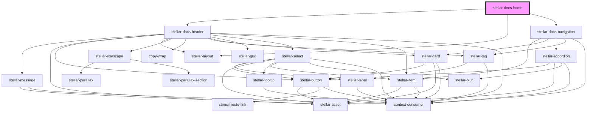

# stellar-docs-home

<!-- Auto Generated Below -->

## Dependencies

### Depends on

- [stellar-docs-header](../header)
- [stellar-layout](../../ui/layout)
- [stellar-docs-navigation](../navigation)

### Graph

----------------------------------------------

*Built with [StencilJS](https://stenciljs.com/)*
