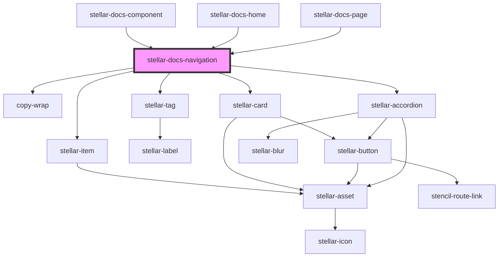

# stellar-docs-navigation

<!-- Auto Generated Below -->

## Dependencies

### Used by

 - [stellar-docs-component](../component)
 - [stellar-docs-home](../home)
 - [stellar-docs-page](../page)

### Depends on

- [stellar-item](../../forms/item)
- [copy-wrap](../../ui/copy-wrap)
- [stellar-tag](../../ui/tag)
- [stellar-card](../../ui/card)
- [stellar-accordion](../../ui/accordion)

### Graph

----------------------------------------------

*Built with [StencilJS](https://stenciljs.com/)*
