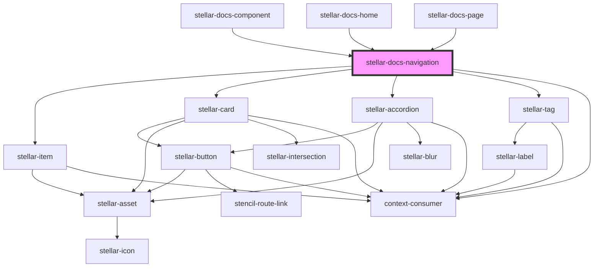

# stellar-docs-navigation

<!-- Auto Generated Below -->

## Properties

| Property        | Attribute       | Description | Type  | Default     |
| --------------- | --------------- | ----------- | ----- | ----------- |
| `collection`    | `collection`    |             | `any` | `undefined` |
| `documentation` | `documentation` |             | `any` | `undefined` |
| `loader`        | `loader`        |             | `any` | `undefined` |
| `ready`         | `ready`         |             | `any` | `undefined` |

## Dependencies

### Used by

 - [stellar-docs-component](../component)
 - [stellar-docs-home](../home)
 - [stellar-docs-page](../page)

### Depends on

- [stellar-item](../../forms/item)
- [stellar-card](../../ui/card)
- [stellar-accordion](../../ui/accordion)
- [stellar-tag](../../ui/tag)
- context-consumer

### Graph

----------------------------------------------

*Built with [StencilJS](https://stenciljs.com/)*
