# stellar-docs-page

<!-- Auto Generated Below -->

## Properties

| Property | Attribute | Description | Type           | Default     |
| -------- | --------- | ----------- | -------------- | ----------- |
| `match`  | --        |             | `MatchResults` | `undefined` |

## Dependencies

### Depends on

- [stellar-docs-header](../header)
- [stellar-layout](../../ui/layout)
- [stellar-docs-navigation](../navigation)
- [stellar-markdown](../../helpers/markdown)

### Graph

```mermaid
graph TD;
  stellar-docs-page --> stellar-docs-header
  stellar-docs-page --> stellar-layout
  stellar-docs-page --> stellar-docs-navigation
  stellar-docs-page --> stellar-markdown
  stellar-docs-header --> stellar-message
  stellar-docs-header --> stellar-asset
  stellar-docs-header --> stellar-button
  stellar-docs-header --> stellar-layout
  stellar-docs-header --> stellar-starscape
  stellar-docs-header --> copy-wrap
  stellar-docs-header --> stellar-tag
  stellar-docs-header --> stellar-card
  stellar-docs-header --> stellar-grid
  stellar-docs-header --> stellar-select
  stellar-docs-header --> stellar-item
  stellar-docs-header --> stellar-toggle
  stellar-docs-header --> stellar-toggle-option
  stellar-message --> stellar-asset
  stellar-asset --> stellar-icon
  stellar-button --> stellar-asset
  stellar-button --> stencil-route-link
  stellar-starscape --> stellar-parallax
  stellar-starscape --> stellar-parallax-section
  stellar-tag --> stellar-label
  stellar-card --> stellar-button
  stellar-card --> stellar-asset
  stellar-select --> stellar-label
  stellar-select --> stellar-button
  stellar-select --> stellar-asset
  stellar-select --> stellar-item
  stellar-select --> stellar-tooltip
  stellar-select --> stellar-blur
  stellar-item --> stellar-asset
  stellar-toggle --> stellar-grid
  stellar-toggle --> stellar-label
  stellar-toggle-option --> stellar-asset
  stellar-toggle-option --> stellar-blur
  stellar-toggle-option --> stellar-tag
  stellar-toggle-option --> stellar-tooltip
  stellar-docs-navigation --> stellar-item
  stellar-docs-navigation --> copy-wrap
  stellar-docs-navigation --> stellar-tag
  stellar-docs-navigation --> stellar-card
  stellar-docs-navigation --> stellar-accordion
  stellar-accordion --> stellar-button
  stellar-accordion --> stellar-asset
  stellar-accordion --> stellar-blur
  stellar-markdown --> stellar-card
  stellar-markdown --> copy-wrap
  stellar-markdown --> stellar-input
  stellar-input --> stellar-label
  stellar-input --> copy-wrap
  stellar-input --> stellar-asset
  stellar-input --> stellar-unit
  stellar-input --> stellar-tooltip
  style stellar-docs-page fill:#f9f,stroke:#333,stroke-width:4px
```

----------------------------------------------

*Built with [StencilJS](https://stenciljs.com/)*
