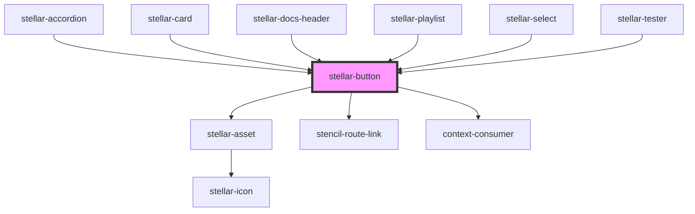

# stellar-button

<!-- Auto Generated Below -->

## Usage

### Block

<stellar-button block></stellar-button>

### Default

<stellar-button></stellar-button>

### Ghost

<stellar-button ghost></stellar-button>

### Outline

<stellar-button outline></stellar-button>

### Pill

<stellar-button pill></stellar-button>

## Properties

| Property      | Attribute     | Description                                                                                           | Type                                                       | Default     |
| ------------- | ------------- | ----------------------------------------------------------------------------------------------------- | ---------------------------------------------------------- | ----------- |
| `active`      | `active`      | Sets the button or link as an active state.                                                           | `boolean`                                                  | `false`     |
| `block`       | `block`       | Sets the button or link to render at full width to the parent.                                        | `boolean`                                                  | `false`     |
| `contrast`    | `contrast`    | Sets the button or link as an outlined button.                                                        | `boolean`                                                  | `false`     |
| `danger`      | `danger`      | Sets the button or link to provide the affordance of a dangerous action.                              | `boolean`                                                  | `false`     |
| `dark`        | `dark`        | Sets the button or link as an outlined button.                                                        | `boolean`                                                  | `false`     |
| `disabled`    | `disabled`    | Sets the button or link as disabled and not-interactable.                                             | `boolean`                                                  | `false`     |
| `for`         | `for`         | Sets the href on the anchor tag if the button is a link.                                              | `string`                                                   | `undefined` |
| `ghost`       | `ghost`       |                                                                                                       | `boolean`                                                  | `false`     |
| `href`        | `href`        | Sets the href on the anchor tag if the button is a link.                                              | `string`                                                   | `'#'`       |
| `icon`        | `icon`        | Sets the button or link as a button with only an icon.                                                | `boolean`                                                  | `false`     |
| `invert`      | `invert`      | Sets the button or link as an outlined button.                                                        | `boolean`                                                  | `false`     |
| `label`       | `label`       | Sets accessibility options on the buttons                                                             | `string`                                                   | `'Submit'`  |
| `name`        | `name`        | Sets the name on the button if the button is an input. Allows the button to act as an item in a form. | `string`                                                   | `''`        |
| `outline`     | `outline`     | Sets the button or link as an outlined button.                                                        | `boolean`                                                  | `false`     |
| `padding`     | `padding`     | Sets the padding inside of the button. Can be small, medium, or large.                                | `"large" \| "medium" \| "small" \| "tiny"`                 | `undefined` |
| `pill`        | `pill`        | Sets the button or link to render as a pill.                                                          | `boolean`                                                  | `false`     |
| `processable` | `processable` | Sets the button or link as processing when clicked.                                                   | `boolean`                                                  | `false`     |
| `size`        | `size`        | Sets the size of the button. Can be tiny, small, medium, or large.                                    | `"large" \| "medium" \| "small" \| "tiny"`                 | `undefined` |
| `tag`         | `tag`         | Allows the button to render for different tags.                                                       | `"button" \| "link" \| "route-link" \| "span" \| "submit"` | `"link"`    |
| `target`      | `target`      | Sets the target on the anchor tag if the button is a link.                                            | `string`                                                   | `'_self'`   |
| `value`       | `value`       | Sets the value on the button if the button is an input.                                               | `string`                                                   | `''`        |

## Dependencies

### Used by

 - [stellar-accordion](../../ui/accordion)
 - [stellar-card](../../ui/card)
 - [stellar-docs-header](../../docs/header)
 - [stellar-playlist](../../media/playlist)
 - [stellar-select](../select)
 - [stellar-tester](../../tester)

### Depends on

- [stellar-asset](../../ui/asset)
- stencil-route-link
- context-consumer

### Graph

----------------------------------------------

*Built with [StencilJS](https://stenciljs.com/)*
