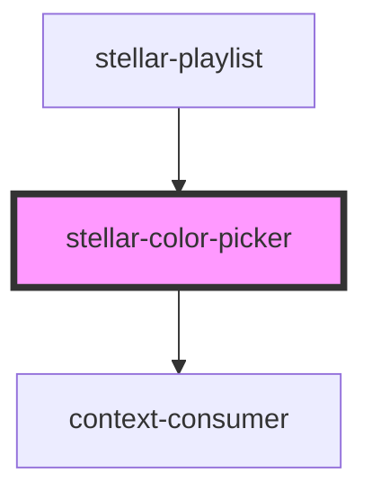

# stellar-color-picker

<!-- Auto Generated Below -->

## Properties

| Property        | Attribute       | Description                                    | Type      | Default  |
| --------------- | --------------- | ---------------------------------------------- | --------- | -------- |
| `dark`          | `dark`          | Sets the button or link as an outlined button. | `boolean` | `false`  |
| `notransparent` | `notransparent` |                                                | `boolean` | `false`  |
| `val`           | `val`           |                                                | `string`  | `"none"` |

## Events

| Event    | Description | Type               |
| -------- | ----------- | ------------------ |
| `update` |             | `CustomEvent<any>` |

## Dependencies

### Used by

 - [stellar-playlist](../../media/playlist)

### Depends on

- context-consumer

### Graph

----------------------------------------------

*Built with [StencilJS](https://stenciljs.com/)*
