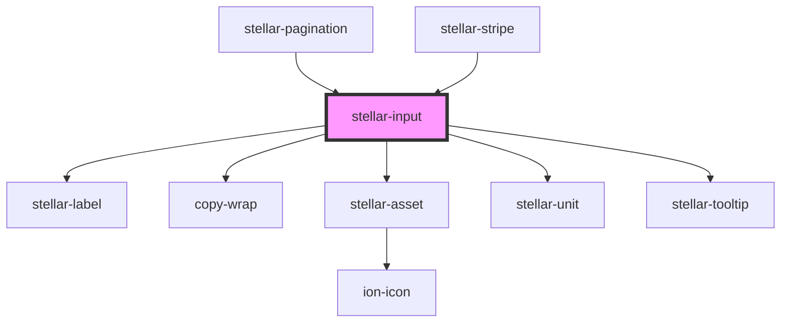

# stellar-input

<!-- Auto Generated Below -->

## Usage

### Default

<stellar-input type="text" label="Name" name="text" placeholder="Text input"></stellar-input>
<stellar-input type="email" label="Email" name="email" placeholder="Email address"></stellar-input>
<stellar-input type="password" label="Password" name="password" placeholder="Password"></stellar-input>
<stellar-input type="search" label="Search..." name="search" placeholder="Search..."></stellar-input>
<stellar-input type="number" label="Choose a number" name="number" placeholder="Choose a number"></stellar-input>
<stellar-input type="tel" label="What's your phone number?" name="tel" placeholder="Enter a telephone number"></stellar-input>
<stellar-input type="url" label="What's your website?" name="url" placeholder="Enter a url"></stellar-input>
<stellar-input type="date" label="Date" name="date" placeholder="Enter a date"></stellar-input>
<stellar-input type="datetime-local" label="Localized Date" name="datetime-local" placeholder="Enter a date"></stellar-input>
<stellar-input type="time" label="Pick a Time" name="time" placeholder="Enter a time"></stellar-input>
<stellar-input type="week" label="Choose a week" name="week" placeholder="Choose a Week"></stellar-input>
<stellar-input type="tags" label="Add some #hashtags" name="tags" placeholder="Here's a list of items"></stellar-input>
<stellar-input type="textarea" label="Write something about yourself" name="textarea" placeholder="Write a long note"></stellar-input>

### Sizes

<stellar-input size="small" type="text" label="Name" name="text" placeholder="Text input"></stellar-input>
<stellar-input size="small" type="email" label="Email" name="email" placeholder="Email address"></stellar-input>
<stellar-input size="small" type="password" label="Password" name="password" placeholder="Password"></stellar-input>
<stellar-input size="small" type="search" label="Search..." name="search" placeholder="Search..."></stellar-input>
<stellar-input size="small" type="number" label="Choose a number" name="number" placeholder="Choose a number"></stellar-input>
<stellar-input size="small" type="tel" label="What's your phone number?" name="tel" placeholder="Enter a telephone number"></stellar-input>
<stellar-input size="small" type="url" label="What's your website?" name="url" placeholder="Enter a url"></stellar-input>
<stellar-input size="small" type="date" label="Date" name="date" placeholder="Enter a date"></stellar-input>
<stellar-input size="small" type="datetime-local" label="Localized Date" name="datetime-local" placeholder="Enter a date"></stellar-input>
<stellar-input size="small" type="time" label="Pick a Time" name="time" placeholder="Enter a time"></stellar-input>
<stellar-input size="small" type="week" label="Choose a week" name="week" placeholder="Choose a Week"></stellar-input>
<stellar-input size="small" type="tags" label="Add some #hashtags" name="tags" placeholder="Here's a list of items"></stellar-input>
<stellar-input size="small" type="textarea" label="Write something about yourself" name="textarea" placeholder="Write a long note"></stellar-input>

## Properties

| Property              | Attribute               | Description                                              | Type                         | Default           |
| --------------------- | ----------------------- | -------------------------------------------------------- | ---------------------------- | ----------------- |
| `accept`              | `accept`                |                                                          | `string`                     | `undefined`       |
| `autocomplete`        | `autocomplete`          |                                                          | `string`                     | `undefined`       |
| `autofocus`           | `autofocus`             |                                                          | `boolean`                    | `false`           |
| `color`               | `color`                 |                                                          | `string`                     | `"theme"`         |
| `cols`                | `cols`                  |                                                          | `number`                     | `30`              |
| `dateType`            | `date-type`             |                                                          | `"day" \| "month" \| "year"` | `"day"`           |
| `default`             | `default`               | The pre-set value to pass to the input element           | `any`                        | `undefined`       |
| `description`         | `description`           |                                                          | `string`                     | `undefined`       |
| `disabled`            | `disabled`              |                                                          | `boolean`                    | `undefined`       |
| `droppable`           | `droppable`             |                                                          | `boolean`                    | `false`           |
| `files`               | --                      |                                                          | `any[]`                      | `[]`              |
| `focused`             | `focused`               |                                                          | `boolean`                    | `false`           |
| `icon`                | `icon`                  |                                                          | `boolean`                    | `false`           |
| `label`               | `label`                 |                                                          | `string`                     | `undefined`       |
| `match`               | `match`                 |                                                          | `string`                     | `undefined`       |
| `max`                 | `max`                   |                                                          | `number`                     | `undefined`       |
| `maxlength`           | `maxlength`             |                                                          | `number`                     | `1000`            |
| `min`                 | `min`                   |                                                          | `number`                     | `undefined`       |
| `multiple`            | `multiple`              |                                                          | `boolean`                    | `false`           |
| `multipleFileCaption` | `multiple-file-caption` |                                                          | `string`                     | `'{count} files'` |
| `name`                | `name`                  | The name of the input element                            | `string`                     | `undefined`       |
| `novalidate`          | `novalidate`            |                                                          | `boolean`                    | `false`           |
| `placeholder`         | `placeholder`           |                                                          | `string`                     | `"Enter a value"` |
| `readonly`            | `readonly`              |                                                          | `boolean`                    | `false`           |
| `replace_placeholder` | `replace_placeholder`   |                                                          | `string`                     | `"Replace file"`  |
| `required`            | `required`              |                                                          | `boolean`                    | `false`           |
| `requirements`        | `requirements`          | The pre-set value to pass to the input element           | `boolean`                    | `false`           |
| `rows`                | `rows`                  |                                                          | `number`                     | `5`               |
| `size`                | `size`                  |                                                          | `string`                     | `undefined`       |
| `spellcheck`          | `spellcheck`            |                                                          | `boolean`                    | `true`            |
| `step`                | `step`                  |                                                          | `number`                     | `1`               |
| `tokenField`          | `token-field`           |                                                          | `any`                        | `undefined`       |
| `tooltip`             | `tooltip`               |                                                          | `string`                     | `undefined`       |
| `type`                | `type`                  | The kind of element that the Input should be rendered as | `string`                     | `"text"`          |
| `validates`           | `validates`             |                                                          | `string`                     | `undefined`       |
| `value`               | `value`                 | The pre-set value to pass to the input element           | `any`                        | `undefined`       |
| `wrap`                | `wrap`                  |                                                          | `string`                     | `"soft"`          |

## Events

| Event      | Description           | Type               |
| ---------- | --------------------- | ------------------ |
| `bluring`  | Public: Blur event    | `CustomEvent<any>` |
| `change`   | Public: Changed event | `CustomEvent<any>` |
| `focusing` | Public: Focus event   | `CustomEvent<any>` |

## Methods

### `getDatePicker() => Promise<any>`

#### Returns

Type: `Promise<any>`

### `getId() => Promise<string>`

#### Returns

Type: `Promise<string>`

### `getStrength() => Promise<object>`

#### Returns

Type: `Promise<object>`

### `invalid(message: string | boolean, valid?: boolean, level?: number) => Promise<void>`

#### Returns

Type: `Promise<void>`

### `setStrength(value: number) => Promise<void>`

#### Returns

Type: `Promise<void>`

### `val() => Promise<any>`

#### Returns

Type: `Promise<any>`

### `validate() => Promise<FormResult>`

#### Returns

Type: `Promise<FormResult>`

## Dependencies

### Used by

 - [stellar-pagination](../../ui/pagination)
 - [stellar-stripe](../../helpers/stripe)

### Depends on

- [stellar-label](../label)
- [copy-wrap](../../ui/copy-wrap)
- [stellar-asset](../../ui/asset)
- [stellar-unit](../../helpers/unit)
- [stellar-tooltip](../../ui/tooltip)

### Graph

----------------------------------------------

*Built with [StencilJS](https://stenciljs.com/)*
