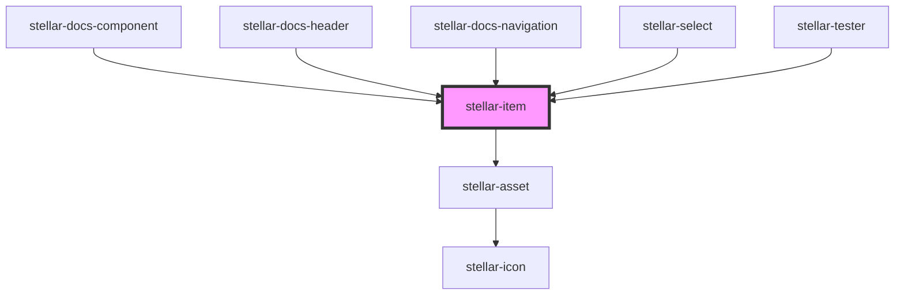

# stellar-button

<!-- Auto Generated Below -->

## Properties

| Property      | Attribute      | Description | Type                                      | Default     |
| ------------- | -------------- | ----------- | ----------------------------------------- | ----------- |
| `danger`      | `danger`       |             | `boolean`                                 | `false`     |
| `fit`         | `fit`          |             | `boolean`                                 | `false`     |
| `focused`     | `focused`      |             | `boolean`                                 | `false`     |
| `history`     | --             |             | `RouterHistory`                           | `undefined` |
| `href`        | `href`         |             | `string`                                  | `"#"`       |
| `label`       | `label`        |             | `string`                                  | `undefined` |
| `location`    | --             |             | `LocationSegments`                        | `undefined` |
| `multiple`    | `multiple`     |             | `boolean`                                 | `false`     |
| `route`       | `route`        |             | `boolean`                                 | `false`     |
| `selectTitle` | `select-title` |             | `boolean`                                 | `false`     |
| `selectable`  | `selectable`   |             | `boolean`                                 | `false`     |
| `selected`    | `selected`     |             | `boolean`                                 | `false`     |
| `simple`      | `simple`       |             | `boolean`                                 | `false`     |
| `size`        | `size`         |             | `string`                                  | `undefined` |
| `type`        | `type`         |             | `"a" \| "button" \| "stencil-route-link"` | `"button"`  |
| `value`       | `value`        |             | `string`                                  | `undefined` |
| `valueLabel`  | `value-label`  |             | `string`                                  | `undefined` |
| `wrap`        | `wrap`         |             | `boolean`                                 | `false`     |

## Events

| Event              | Description | Type               |
| ------------------ | ----------- | ------------------ |
| `blurChanged`      |             | `CustomEvent<any>` |
| `focusChanged`     |             | `CustomEvent<any>` |
| `mounted`          |             | `CustomEvent<any>` |
| `selectionChanged` |             | `CustomEvent<any>` |

## Methods

### `apply(data: any) => Promise<void>`

#### Returns

Type: `Promise<void>`

### `data() => Promise<{ size: string; value: string; type: "button" | "a" | "stencil-route-link"; label: string; danger: boolean; slotted: string; }>`

#### Returns

Type: `Promise<{ size: string; value: string; type: "button" | "a" | "stencil-route-link"; label: string; danger: boolean; slotted: string; }>`

### `select_item(state?: { selected: boolean; }) => Promise<void>`

#### Returns

Type: `Promise<void>`

### `setFocus() => Promise<void>`

#### Returns

Type: `Promise<void>`

## Dependencies

### Used by

 - [stellar-docs-component](../../docs/component)
 - [stellar-docs-header](../../docs/header)
 - [stellar-docs-navigation](../../docs/navigation)
 - [stellar-select](../select)
 - [stellar-tester](../../tester)

### Depends on

- [stellar-asset](../../ui/asset)

### Graph

----------------------------------------------

*Built with [StencilJS](https://stenciljs.com/)*
