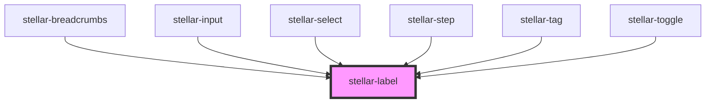

# stellar-label

<!-- Auto Generated Below -->

## Properties

| Property     | Attribute    | Description | Type      | Default     |
| ------------ | ------------ | ----------- | --------- | ----------- |
| `for`        | `for`        |             | `string`  | `undefined` |
| `size`       | `size`       |             | `string`  | `undefined` |
| `underneath` | `underneath` |             | `boolean` | `undefined` |

## Dependencies

### Used by

 - [stellar-breadcrumbs](../../ui/breadcrumbs)
 - [stellar-input](../input)
 - [stellar-select](../select)
 - [stellar-step](../../ui/step)
 - [stellar-tag](../../ui/tag)
 - [stellar-toggle](../toggle)

### Graph

----------------------------------------------

*Built with [StencilJS](https://stenciljs.com/)*
