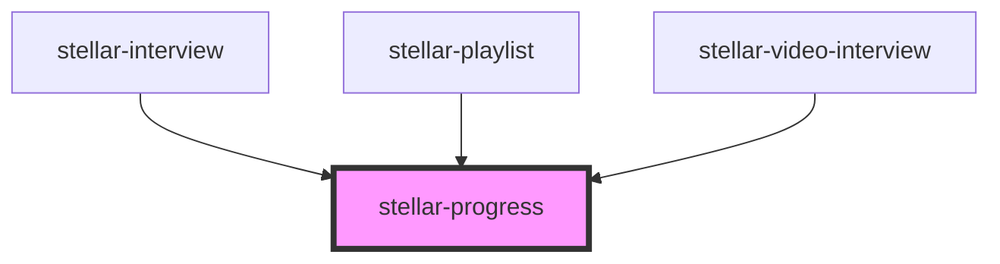

# stellar-progress

<!-- Auto Generated Below -->

## Usage

### Default

<stellar-progress value="1" max="20" id="awesome" slender></stellar-progress>
<stellar-button onClick="document.querySelector('#awesome').value = 3">3</stellar-button>
<stellar-button onClick="document.querySelector('#awesome').value = 9">9</stellar-button>
<stellar-button onClick="document.querySelector('#awesome').value = 18">18</stellar-button>
<stellar-button onClick="document.querySelector('#awesome').slender = !document.querySelector('#awesome').slender">Toggle slender</stellar-button>

## Properties

| Property        | Attribute       | Description                                                                                             | Type      | Default |
| --------------- | --------------- | ------------------------------------------------------------------------------------------------------- | --------- | ------- |
| `blurable`      | `blurable`      |                                                                                                         | `boolean` | `true`  |
| `editable`      | `editable`      | Allows the progress bar to be clicked on, to help the user to navigate through the progressing content. | `boolean` | `false` |
| `indeterminate` | `indeterminate` | Sets the maximum cap for steps in the progress bar                                                      | `boolean` | `false` |
| `max`           | `max`           | Sets the maximum cap for steps in the progress bar                                                      | `number`  | `100`   |
| `noease`        | `noease`        | eliminates the easing in the css so you can apply value updates without jitter.                         | `boolean` | `false` |
| `rounded`       | `rounded`       | eliminates the easing in the css so you can apply value updates without jitter.                         | `boolean` | `false` |
| `secondary`     | `secondary`     | Sets the value of the progress bar                                                                      | `number`  | `0`     |
| `slender`       | `slender`       | Renders if this element is slender or not                                                               | `boolean` | `false` |
| `value`         | `value`         | Sets the value of the progress bar                                                                      | `number`  | `0`     |

## Events

| Event    | Description | Type               |
| -------- | ----------- | ------------------ |
| `update` |             | `CustomEvent<any>` |

## Dependencies

### Used by

 - [stellar-interview](../../media/interview)
 - [stellar-playlist](../../media/playlist)
 - [stellar-video-interview](../../media/video-interview)

### Graph

----------------------------------------------

*Built with [StencilJS](https://stenciljs.com/)*
