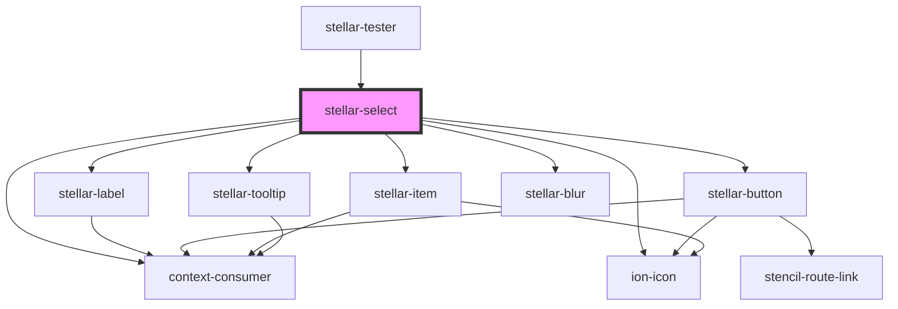

# stellar-select

<!-- Auto Generated Below -->

## Usage

### Default

<stellar-select name="our_select" label="What do you want?">
  <stellar-item value="one" label="Label one" selected>
    <stellar-avatar size="small"></stellar-avatar>
    Great
  </stellar-item>
  <stellar-item value="two" label="Label two">
    <stellar-avatar shape="circle" size="small"></stellar-avatar>
    Great
  </stellar-item>
  <stellar-item value="two" label="Label two">
    <stellar-avatar shape="square" size="small"></stellar-avatar>
    Great
  </stellar-item>
  <stellar-item value="three" label="Label three">
    <stellar-avatar shape="rectangle" size="small"></stellar-avatar>
    Great
  </stellar-item>
  <stellar-item value="four" label="Label four">
    Great
  </stellar-item>
  <stellar-item value="one" label="Label one">
    <stellar-avatar size="small"></stellar-avatar>
    Great
  </stellar-item>
  <stellar-item value="two" label="Label two">
    <stellar-avatar shape="circle" size="small"></stellar-avatar>
    Great
  </stellar-item>
  <stellar-item value="two" label="Label two">
    <stellar-avatar shape="square" size="small"></stellar-avatar>
    Great
  </stellar-item>
  <stellar-item value="three" label="Label three">
    <stellar-avatar shape="rectangle" size="small"></stellar-avatar>
    Great
  </stellar-item>
  <stellar-item value="four" label="Label four">
    Great
  </stellar-item>
</stellar-select>

### Multiple

<stellar-select name="our_select" label="What do you want?" size="small" multiple>
  <stellar-item value="one" label="Label one" selected>
    Awesome
  </stellar-item>
  <stellar-item value="two" label="Label two">
    Awesome
  </stellar-item>
  <stellar-item value="three" label="Label three">
    Awesome
  </stellar-item>
  <stellar-item value="four" label="Label four">
    Awesome
  </stellar-item>
  <stellar-item value="one" label="Label one">
    Awesome
  </stellar-item>
  <stellar-item value="two" label="Label two">
    Awesome
  </stellar-item>
  <stellar-item value="three" label="Label three">
    Awesome
  </stellar-item>
  <stellar-item value="four" label="Label four">
    Awesome
  </stellar-item>
  <stellar-item value="one" label="Label one">
    Awesome
  </stellar-item>
  <stellar-item value="two" label="Label two">
    Awesome
  </stellar-item>
  <stellar-item value="three" label="Label three">
    Awesome
  </stellar-item>
  <stellar-item value="four" label="Label four">
    Awesome
  </stellar-item>
</stellar-select>

### Overlay

<stellar-select name="our_select" label="What do you want?" overlay>
  <stellar-item value="one" label="Label one" selected>
    Awesome
  </stellar-item>
  <stellar-item value="two" label="Label two">
    Awesome
  </stellar-item>
  <stellar-item value="three" label="Label three">
    Awesome
  </stellar-item>
  <stellar-item value="four" label="Label four">
    Awesome
  </stellar-item>
  <stellar-item value="one" label="Label one">
    Awesome
  </stellar-item>
  <stellar-item value="two" label="Label two">
    Awesome
  </stellar-item>
  <stellar-item value="three" label="Label three">
    Awesome
  </stellar-item>
  <stellar-item value="four" label="Label four">
    Awesome
  </stellar-item>
  <stellar-item value="one" label="Label one">
    Awesome
  </stellar-item>
  <stellar-item value="two" label="Label two">
    Awesome
  </stellar-item>
  <stellar-item value="three" label="Label three">
    Awesome
  </stellar-item>
  <stellar-item value="four" label="Label four">
    Awesome
  </stellar-item>
</stellar-select>

### Small

<stellar-select name="our_select" label="What do you want?" size="small">
  <stellar-item value="one" label="Label one" selected>
    Awesome
  </stellar-item>
  <stellar-item value="two" label="Label two">
    Awesome
  </stellar-item>
  <stellar-item value="three" label="Label three">
    Awesome
  </stellar-item>
  <stellar-item value="four" label="Label four">
    Awesome
  </stellar-item>
  <stellar-item value="one" label="Label one">
    Awesome
  </stellar-item>
  <stellar-item value="two" label="Label two">
    Awesome
  </stellar-item>
  <stellar-item value="three" label="Label three">
    Awesome
  </stellar-item>
  <stellar-item value="four" label="Label four">
    Awesome
  </stellar-item>
  <stellar-item value="one" label="Label one">
    Awesome
  </stellar-item>
  <stellar-item value="two" label="Label two">
    Awesome
  </stellar-item>
  <stellar-item value="three" label="Label three">
    Awesome
  </stellar-item>
  <stellar-item value="four" label="Label four">
    Awesome
  </stellar-item>
</stellar-select>

## Properties

| Property              | Attribute              | Description                                    | Type                                       | Default                 |
| --------------------- | ---------------------- | ---------------------------------------------- | ------------------------------------------ | ----------------------- |
| `autoSelectFirst`     | `auto-select-first`    |                                                | `boolean`                                  | `false`                 |
| `dark`                | `dark`                 | Sets the button or link as an outlined button. | `boolean`                                  | `false`                 |
| `default`             | `default`              |                                                | `any`                                      | `undefined`             |
| `description`         | `description`          |                                                | `string`                                   | `undefined`             |
| `fit`                 | `fit`                  |                                                | `boolean`                                  | `false`                 |
| `focused`             | `focused`              |                                                | `boolean`                                  | `undefined`             |
| `footer`              | `footer`               |                                                | `boolean`                                  | `undefined`             |
| `inline`              | `inline`               |                                                | `boolean`                                  | `undefined`             |
| `label`               | `label`                |                                                | `string`                                   | `undefined`             |
| `loading`             | `loading`              |                                                | `boolean`                                  | `false`                 |
| `multiple`            | `multiple`             |                                                | `boolean`                                  | `undefined`             |
| `name`                | `name`                 |                                                | `boolean or string`                        | `"select"`              |
| `novalidate`          | `novalidate`           |                                                | `boolean`                                  | `undefined`             |
| `open`                | `open`                 |                                                | `boolean`                                  | `false`                 |
| `other`               | `other`                |                                                | `boolean`                                  | `undefined`             |
| `overlay`             | `overlay`              |                                                | `boolean`                                  | `undefined`             |
| `placeholder`         | `placeholder`          |                                                | `string`                                   | `"Choose something..."` |
| `placeholderInverted` | `placeholder-inverted` |                                                | `boolean`                                  | `undefined`             |
| `processing`          | `processing`           |                                                | `boolean`                                  | `undefined`             |
| `required`            | `required`             |                                                | `boolean`                                  | `false`                 |
| `resize`              | `resize`               |                                                | `"full" or boolean`                        | `false`                 |
| `size`                | `size`                 |                                                | `"large" or "medium" or "small" or "tiny"` | `undefined`             |
| `tooltip`             | `tooltip`              |                                                | `string`                                   | `undefined`             |
| `value`               | `value`                |                                                | `string or string[]`                       | `undefined`             |
| `valueLabel`          | `value-label`          |                                                | `string`                                   | `undefined`             |
| `verbiage`            | `verbiage`             |                                                | `string`                                   | `"selection"`           |
| `verbiageAn`          | `verbiage-an`          |                                                | `boolean`                                  | `undefined`             |
| `wrap`                | `wrap`                 |                                                | `boolean`                                  | `false`                 |

## Events

| Event    | Description | Type               |
| -------- | ----------- | ------------------ |
| `update` |             | `CustomEvent<any>` |

## Methods

### `option_elements() => Promise<NodeListOf<any>>`

#### Returns

Type: `Promise<NodeListOf<any>>`

### `options() => Promise<string[]>`

#### Returns

Type: `Promise<string[]>`

### `update_values() => Promise<void>`

#### Returns

Type: `Promise<void>`

### `validate() => Promise<FormResult>`

#### Returns

Type: `Promise<FormResult>`

## Dependencies

### Used by

 - [stellar-tester](../../tester)

### Depends on

- [stellar-label](../label)
- [stellar-button](../button)
- ion-icon
- [stellar-item](../item)
- [stellar-tooltip](../../ui/tooltip)
- [stellar-blur](../../motion/blur)
- context-consumer

### Graph

----------------------------------------------

*Built with [StencilJS](https://stenciljs.com/)*
