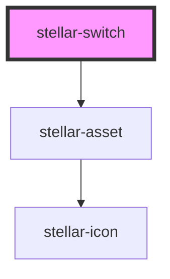

# stellar-accordian

<!-- Auto Generated Below -->

## Usage

### Default

<stellar-switch></stellar-switch>

### Labels

<stellar-switch>
Here's a helpful description of what this switch does!
</stellar-switch>

## Properties

| Property         | Attribute         | Description | Type      | Default |
| ---------------- | ----------------- | ----------- | --------- | ------- |
| `checked`        | `checked`         |             | `boolean` | `false` |
| `checkedDefault` | `checked-default` |             | `boolean` | `false` |

## Events

| Event    | Description | Type               |
| -------- | ----------- | ------------------ |
| `update` |             | `CustomEvent<any>` |

## Methods

### `activate() => Promise<void>`

#### Returns

Type: `Promise<void>`

## Dependencies

### Depends on

- [stellar-asset](../../ui/asset)

### Graph

----------------------------------------------

*Built with [StencilJS](https://stenciljs.com/)*
