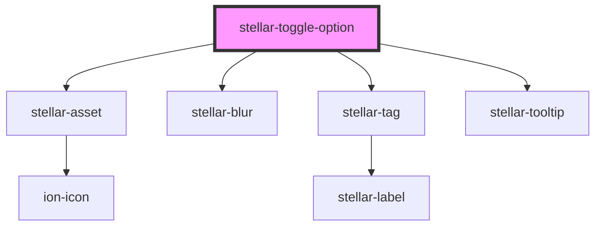

# stellar-toggle-option

<!-- Auto Generated Below -->

## Properties

| Property         | Attribute         | Description | Type      | Default       |
| ---------------- | ----------------- | ----------- | --------- | ------------- |
| `checked`        | `checked`         |             | `boolean` | `false`       |
| `checkedDefault` | `checked-default` |             | `boolean` | `false`       |
| `default`        | `default`         |             | `string`  | `""`          |
| `disabled`       | `disabled`        |             | `boolean` | `undefined`   |
| `for`            | `for`             |             | `string`  | `""`          |
| `icon`           | `icon`            |             | `boolean` | `undefined`   |
| `inline`         | `inline`          |             | `boolean` | `undefined`   |
| `name`           | `name`            |             | `string`  | `undefined`   |
| `required`       | `required`        |             | `boolean` | `undefined`   |
| `selectedCopy`   | `selected-copy`   |             | `string`  | `"Selected!"` |
| `single`         | `single`          |             | `boolean` | `undefined`   |
| `size`           | `size`            |             | `boolean` | `undefined`   |
| `tooltip`        | `tooltip`         |             | `string`  | `undefined`   |
| `type`           | `type`            |             | `string`  | `"checkbox"`  |
| `value`          | `value`           |             | `string`  | `undefined`   |

## Events

| Event    | Description | Type               |
| -------- | ----------- | ------------------ |
| `change` |             | `CustomEvent<any>` |

## Methods

### `confirm() => Promise<void>`

#### Returns

Type: `Promise<void>`

### `updateSelected(value: boolean) => Promise<void>`

#### Returns

Type: `Promise<void>`

## Dependencies

### Depends on

- [stellar-asset](../../ui/asset)
- [stellar-blur](../../motion/blur)
- [stellar-tag](../../ui/tag)
- [stellar-tooltip](../../ui/tooltip)

### Graph

----------------------------------------------

*Built with [StencilJS](https://stenciljs.com/)*
