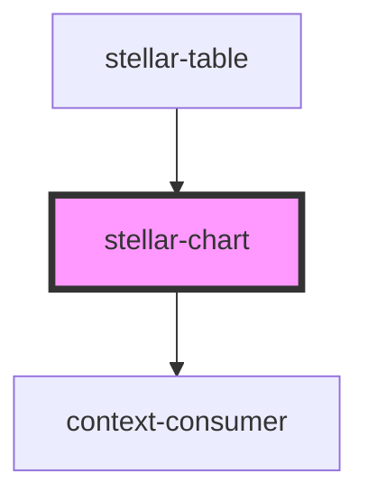

# stellar-chart

<!-- Auto Generated Below -->

## Properties

| Property | Attribute | Description | Type                                                                                                                              | Default               |
| -------- | --------- | ----------- | --------------------------------------------------------------------------------------------------------------------------------- | --------------------- |
| `config` | --        |             | `HighchartsModel`                                                                                                                 | `new HighchartsModel` |
| `dark`   | `dark`    |             | `boolean`                                                                                                                         | `false`               |
| `for`    | `for`     |             | `string`                                                                                                                          | `undefined`           |
| `remote` | `remote`  |             | `string`                                                                                                                          | `undefined`           |
| `type`   | `type`    |             | `"area" \| "areaspline" \| "bar" \| "bubble" \| "column" \| "line" \| "pie" \| "polygon" \| "scatter" \| "spline" \| "waterfall"` | `undefined`           |

## Methods

### `get_options() => Promise<any>`

#### Returns

Type: `Promise<any>`

### `options(newOptions: any) => Promise<void>`

#### Returns

Type: `Promise<void>`

### `refresh() => Promise<void>`

#### Returns

Type: `Promise<void>`

## Dependencies

### Used by

 - [stellar-table](../../ui/table)

### Depends on

- context-consumer

### Graph

----------------------------------------------

*Built with [StencilJS](https://stenciljs.com/)*
