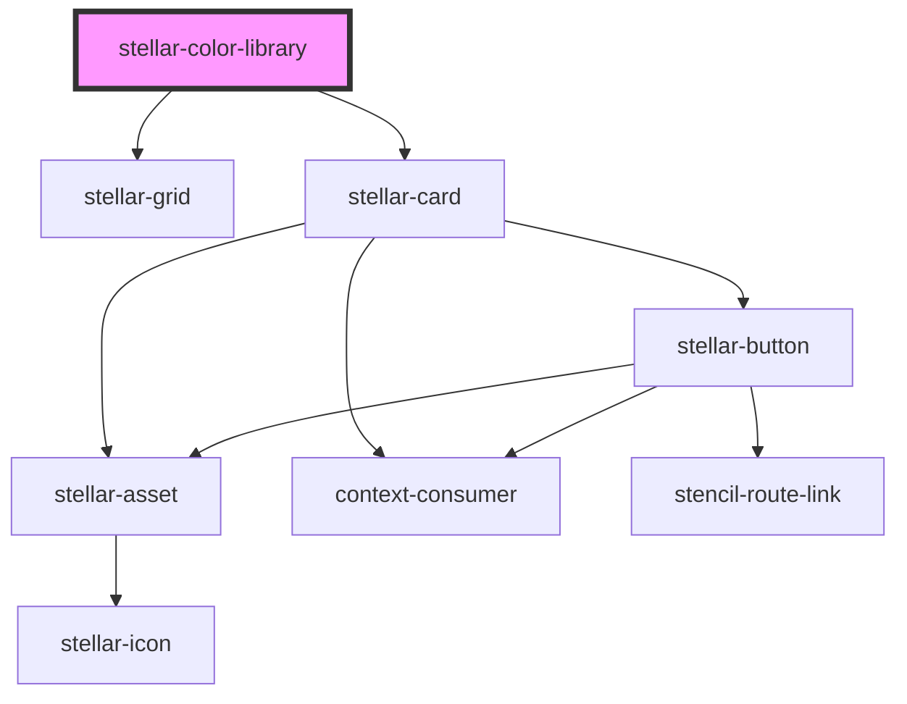

# stellar-color-library

<!-- Auto Generated Below -->

## Usage

### Default

<stellar-color-library></stellar-color-library>

## Properties

| Property | Attribute | Description | Type       | Default     |
| -------- | --------- | ----------- | ---------- | ----------- |
| `colors` | `colors`  |             | `"string"` | `undefined` |

## Dependencies

### Depends on

- [stellar-grid](../../ui/grid)
- [stellar-card](../../ui/card)

### Graph

----------------------------------------------

*Built with [StencilJS](https://stenciljs.com/)*
