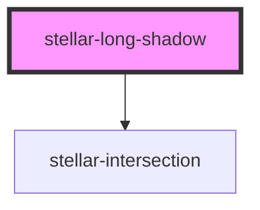

# stellar-long-shadow

<!-- Auto Generated Below -->

## Properties

| Property    | Attribute   | Description | Type                                                           | Default      |
| ----------- | ----------- | ----------- | -------------------------------------------------------------- | ------------ |
| `active`    | `active`    |             | `boolean`                                                      | `false`      |
| `delay`     | `delay`     |             | `number`                                                       | `100`        |
| `direction` | `direction` |             | `"bottom-left" or "bottom-right" or "top-left" or "top-right"` | `"top-left"` |
| `length`    | `length`    |             | `number`                                                       | `100`        |
| `timing`    | `timing`    |             | `number`                                                       | `50`         |

## Methods

### `in() => Promise<void>`

#### Returns

Type: `Promise<void>`

### `out() => Promise<void>`

#### Returns

Type: `Promise<void>`

## Dependencies

### Depends on

- [stellar-intersection](../intersection)

### Graph

----------------------------------------------

*Built with [StencilJS](https://stenciljs.com/)*
