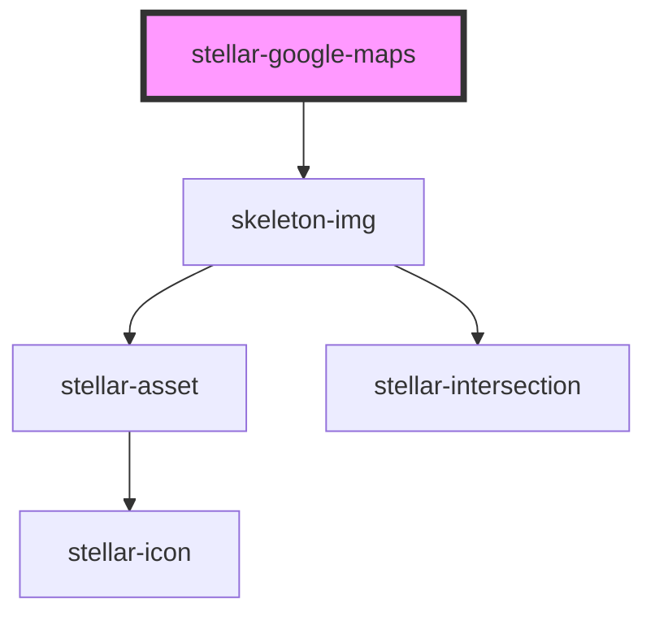

# stellar-google-maps

<!-- Auto Generated Below -->

## Properties

| Property | Attribute | Description | Type      | Default     |
| -------- | --------- | ----------- | --------- | ----------- |
| `apikey` | `apikey`  |             | `string`  | `undefined` |
| `block`  | `block`   |             | `boolean` | `false`     |
| `height` | `height`  |             | `number`  | `900`       |
| `lat`    | `lat`     |             | `number`  | `-34.397`   |
| `lng`    | `lng`     |             | `number`  | `150.644`   |
| `noUi`   | `no-ui`   |             | `boolean` | `false`     |
| `theme`  | `theme`   |             | `string`  | `undefined` |
| `width`  | `width`   |             | `number`  | `1600`      |
| `zoom`   | `zoom`    |             | `number`  | `8`         |

## Dependencies

### Depends on

- [skeleton-img](../../media/skeleton-img)

### Graph

----------------------------------------------

*Built with [StencilJS](https://stenciljs.com/)*
