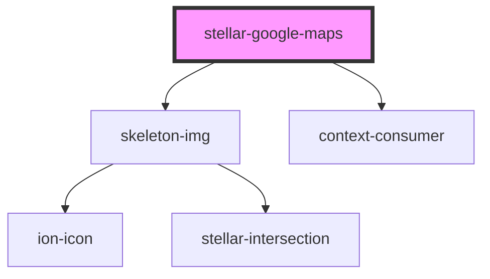

# stellar-google-maps

<!-- Auto Generated Below -->

## Properties

| Property            | Attribute            | Description | Type                                            | Default     |
| ------------------- | -------------------- | ----------- | ----------------------------------------------- | ----------- |
| `apikey`            | `apikey`             |             | `string`                                        | `undefined` |
| `block`             | `block`              |             | `boolean`                                       | `false`     |
| `dark`              | `dark`               |             | `boolean`                                       | `undefined` |
| `darkTheme`         | `dark-theme`         |             | `string`                                        | `undefined` |
| `fullscreenControl` | `fullscreen-control` |             | `boolean`                                       | `false`     |
| `gestureHandling`   | `gesture-handling`   |             | `"auto" or "cooperative" or "greedy" or "none"` | `"auto"`    |
| `height`            | `height`             |             | `number`                                        | `900`       |
| `lat`               | `lat`                |             | `number`                                        | `-34.397`   |
| `lng`               | `lng`                |             | `number`                                        | `150.644`   |
| `mapType`           | `map-type`           |             | `boolean`                                       | `false`     |
| `noUi`              | `no-ui`              |             | `boolean`                                       | `false`     |
| `streetView`        | `street-view`        |             | `boolean`                                       | `false`     |
| `theme`             | `theme`              |             | `string`                                        | `undefined` |
| `width`             | `width`              |             | `number`                                        | `1600`      |
| `zoom`              | `zoom`               |             | `number`                                        | `8`         |
| `zoomControls`      | `zoom-controls`      |             | `boolean`                                       | `false`     |

## Dependencies

### Depends on

- [skeleton-img](../../media/skeleton-img)
- context-consumer

### Graph

----------------------------------------------

*Built with [StencilJS](https://stenciljs.com/)*
