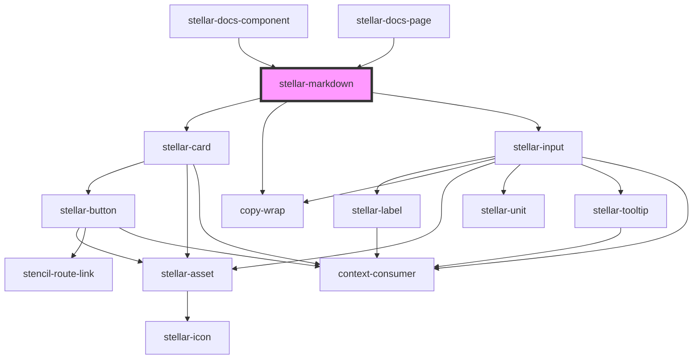

# stellar-markdown

<!-- Auto Generated Below -->

## Usage

### Default

<stellar-markdown src="https://raw.githubusercontent.com/ionic-team/stencil/master/readme.md"></stellar-markdown>

### Template

<stellar-markdown>
  <template>
# Heading
## Very cool!
- item one
- item two
- item three
  </template>
</stellar-markdown>

## Properties

| Property     | Attribute     | Description                                 | Type                                  | Default     |
| ------------ | ------------- | ------------------------------------------- | ------------------------------------- | ----------- |
| `codeString` | `code-string` | Used to set                                 | `string`                              | `undefined` |
| `editable`   | `editable`    |                                             | `boolean`                             | `false`     |
| `flavor`     | `flavor`      |                                             | `"github" \| "original" \| "vanilla"` | `"vanilla"` |
| `src`        | `src`         | Used to reference an external markdown file | `string`                              | `undefined` |

## Dependencies

### Used by

 - [stellar-docs-component](../../docs/component)
 - [stellar-docs-page](../../docs/page)

### Depends on

- [stellar-card](../../ui/card)
- [copy-wrap](../../ui/copy-wrap)
- [stellar-input](../../forms/input)

### Graph

----------------------------------------------

*Built with [StencilJS](https://stenciljs.com/)*
