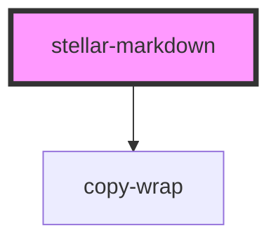

# stellar-markdown

<!-- Auto Generated Below -->

## Usage

### Default

<stellar-markdown src="https://raw.githubusercontent.com/ionic-team/stencil/master/readme.md"></stellar-markdown>

### Template

<stellar-markdown>
  <template>
# Heading
## Very cool!
- item one
- item two
- item three
  </template>
</stellar-markdown>

## Properties

| Property     | Attribute     | Description | Type     | Default     |
| ------------ | ------------- | ----------- | -------- | ----------- |
| `codeString` | `code-string` |             | `string` | `undefined` |
| `src`        | `src`         |             | `string` | `undefined` |

## Dependencies

### Depends on

- [copy-wrap](../../ui/copy-wrap)

### Graph

----------------------------------------------

*Built with [StencilJS](https://stenciljs.com/)*
