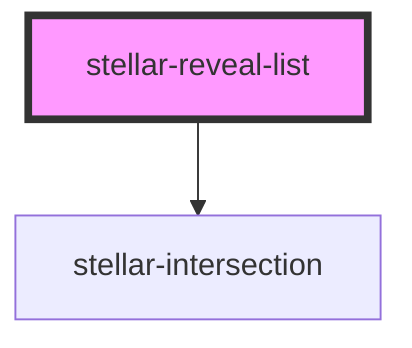

# stellar-reveal

<!-- Auto Generated Below -->

## Properties

| Property       | Attribute       | Description | Type                                        | Default      |
| -------------- | --------------- | ----------- | ------------------------------------------- | ------------ |
| `active`       | `active`        |             | `boolean`                                   | `false`      |
| `animation`    | `animation`     |             | `"fadeIn" \| "fadeInDown" \| "fadeInUp"`    | `"fadeInUp"` |
| `delay`        | `delay`         |             | `number`                                    | `100`        |
| `outAnimation` | `out-animation` |             | `"fadeOut" \| "fadeOutDown" \| "fadeOutUp"` | `"fadeOut"`  |
| `timing`       | `timing`        |             | `number`                                    | `20`         |

## Methods

### `in() => Promise<void>`

#### Returns

Type: `Promise<void>`

### `out() => Promise<void>`

#### Returns

Type: `Promise<void>`

## Dependencies

### Depends on

- [stellar-intersection](../intersection)

### Graph

----------------------------------------------

*Built with [StencilJS](https://stenciljs.com/)*
