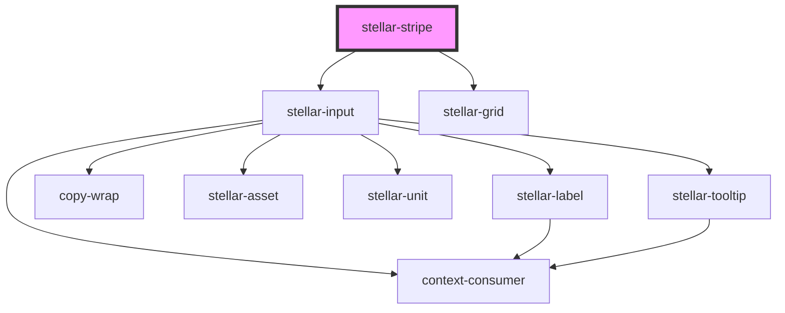

# stellar-card

<!-- Auto Generated Below -->

## Properties

| Property | Attribute | Description | Type     | Default                              |
| -------- | --------- | ----------- | -------- | ------------------------------------ |
| `name`   | `name`    |             | `string` | `'stripe'`                           |
| `token`  | `token`   |             | `string` | `'pk_test_6pRNASCoBOKtIshFeQd4XMUh'` |

## Methods

### `connect() => Promise<void>`

#### Returns

Type: `Promise<void>`

### `getToken() => Promise<boolean>`

#### Returns

Type: `Promise<boolean>`

### `setError(error: string) => Promise<void>`

#### Returns

Type: `Promise<void>`

## Dependencies

### Depends on

- [stellar-input](../../forms/input)
- [stellar-grid](../../ui/grid)

### Graph

----------------------------------------------

*Built with [StencilJS](https://stenciljs.com/)*
