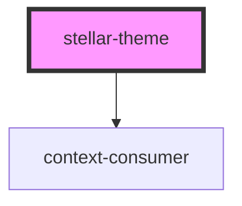

# stellar-dark-mode

<!-- Auto Generated Below -->

## Properties

| Property | Attribute | Description | Type      | Default |
| -------- | --------- | ----------- | --------- | ------- |
| `body`   | `body`    |             | `boolean` | `false` |
| `dark`   | `dark`    |             | `boolean` | `false` |
| `light`  | `light`   |             | `boolean` | `false` |
| `system` | `system`  |             | `boolean` | `false` |

## Dependencies

### Depends on

- context-consumer

### Graph

----------------------------------------------

*Built with [StencilJS](https://stenciljs.com/)*
