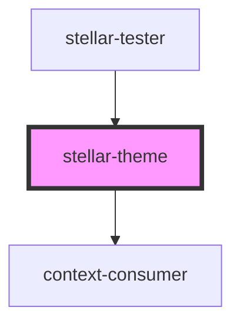

# stellar-dark-mode

<!-- Auto Generated Below -->

## Properties

| Property     | Attribute    | Description | Type      | Default    |
| ------------ | ------------ | ----------- | --------- | ---------- |
| `base`       | `base`       |             | `string`  | `"indigo"` |
| `body`       | `body`       |             | `boolean` | `false`    |
| `complement` | `complement` |             | `string`  | `"red"`    |
| `dark`       | `dark`       |             | `boolean` | `false`    |
| `light`      | `light`      |             | `boolean` | `false`    |
| `system`     | `system`     |             | `boolean` | `false`    |

## Dependencies

### Used by

 - [stellar-tester](../../tester)

### Depends on

- context-consumer

### Graph

----------------------------------------------

*Built with [StencilJS](https://stenciljs.com/)*
