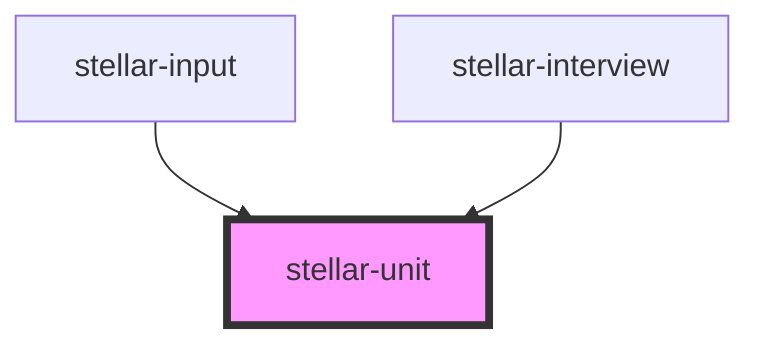

# stellar-asset

<!-- Auto Generated Below -->

## Properties

| Property   | Attribute  | Description | Type      | Default |
| ---------- | ---------- | ----------- | --------- | ------- |
| `decimals` | `decimals` |             | `number`  | `2`     |
| `from`     | `from`     |             | `string`  | `"B"`   |
| `round`    | `round`    |             | `boolean` | `false` |
| `to`       | `to`       |             | `string`  | `"KB"`  |
| `value`    | `value`    |             | `number`  | `1000`  |

## Dependencies

### Used by

 - [stellar-input](../../forms/input)
 - [stellar-interview](../../media/interview)

### Graph

----------------------------------------------

*Built with [StencilJS](https://stenciljs.com/)*
