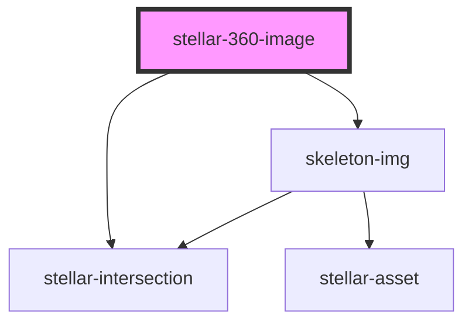

# stellar-360-image

<!-- Auto Generated Below -->

## Properties

| Property     | Attribute    | Description | Type      | Default     |
| ------------ | ------------ | ----------- | --------- | ----------- |
| `height`     | `height`     |             | `number`  | `720`       |
| `nolazyload` | `nolazyload` |             | `boolean` | `false`     |
| `poster`     | `poster`     |             | `string`  | `undefined` |
| `src`        | `src`        |             | `string`  | `undefined` |
| `width`      | `width`      |             | `number`  | `1280`      |

## Dependencies

### Depends on

- [stellar-intersection](../../helpers/intersection)
- [skeleton-img](../skeleton-img)

### Graph

----------------------------------------------

*Built with [StencilJS](https://stenciljs.com/)*
