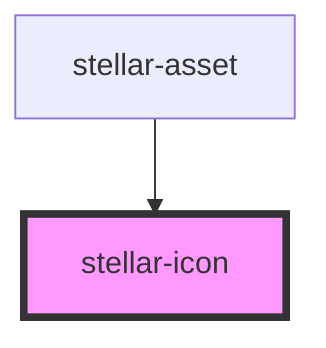

# ion-icon

<!-- Auto Generated Below -->

## Properties

| Property    | Attribute    | Description                                                                                                                                                                    | Type            | Default     |
| ----------- | ------------ | ------------------------------------------------------------------------------------------------------------------------------------------------------------------------------ | --------------- | ----------- |
| `ariaLabel` | `aria-label` | Specifies the label to use for accessibility. Defaults to the icon name.                                                                                                       | `string`        | `undefined` |
| `flipRtl`   | `flip-rtl`   | Specifies whether the icon should horizontally flip when `dir` is `"rtl"`.                                                                                                     | `boolean`       | `undefined` |
| `icon`      | `icon`       | A combination of both `name` and `src`. If a `src` url is detected it will set the `src` property. Otherwise it assumes it's a built-in named SVG and set the `name` property. | `any`           | `undefined` |
| `ios`       | `ios`        | Specifies which icon to use on `ios` mode.                                                                                                                                     | `string`        | `undefined` |
| `lazy`      | `lazy`       | If enabled, stellar-icon will be loaded lazily when it's visible in the viewport. Default, `false`.                                                                            | `boolean`       | `false`     |
| `md`        | `md`         | Specifies which icon to use on `md` mode.                                                                                                                                      | `string`        | `undefined` |
| `mode`      | `mode`       | The mode determines which platform styles to use.                                                                                                                              | `"ios" \| "md"` | `undefined` |
| `name`      | `name`       | Specifies which icon to use from the built-in set of icons.                                                                                                                    | `string`        | `undefined` |
| `size`      | `size`       | The size of the icon. Available options are: `"small"` and `"large"`.                                                                                                          | `string`        | `undefined` |
| `src`       | `src`        | Specifies the exact `src` of an SVG file to use.                                                                                                                               | `string`        | `undefined` |

## Dependencies

### Used by

 - [stellar-asset](../../ui/asset)

### Graph

----------------------------------------------

*Built with [StencilJS](https://stenciljs.com/)*
