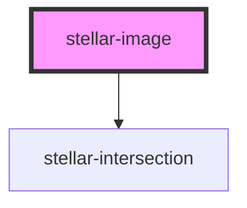

# stellar-image

<!-- Auto Generated Below -->

## Usage

### Default

<stellar-image width="2792" height="1574" preload="./global/images/_images/google_cardboard_will@2x-76x43.jpg">
	<source srcset="./global/images/_images/google_cardboard_will@2x.jpg" media="(min-width:1023px) and (min-device-pixel-ratio: 2)" />
	<source srcset="./global/images/_images/google_cardboard_will@2x-1024x577.jpg" media="(min-width:1023px)" />
	<source srcset="./global/images/_images/google_cardboard_will@2x-1024x577.jpg" media="(max-width:640px) and (min-device-pixel-ratio: 2)" />
	<source srcset="./global/images/_images/google_cardboard_will@2x-640x361.jpg" media="(max-width:640px)" />
</stellar-image>

## Properties

| Property | Attribute | Description | Type                        | Default     |
| -------- | --------- | ----------- | --------------------------- | ----------- |
| `alt`    | `alt`     |             | `string`                    | `""`        |
| `bg`     | `bg`      |             | `string`                    | `"auto"`    |
| `height` | `height`  |             | `number`                    | `undefined` |
| `large`  | `large`   |             | `string`                    | `undefined` |
| `nozoom` | `nozoom`  |             | `boolean`                   | `false`     |
| `poster` | `poster`  |             | `string`                    | `undefined` |
| `type`   | `type`    |             | `"background" \| "picture"` | `"picture"` |
| `width`  | `width`   |             | `number`                    | `undefined` |

## Methods

### `medium() => Promise<any>`

#### Returns

Type: `Promise<any>`

## Dependencies

### Depends on

- [stellar-intersection](../../helpers/intersection)

### Graph

----------------------------------------------

*Built with [StencilJS](https://stenciljs.com/)*
