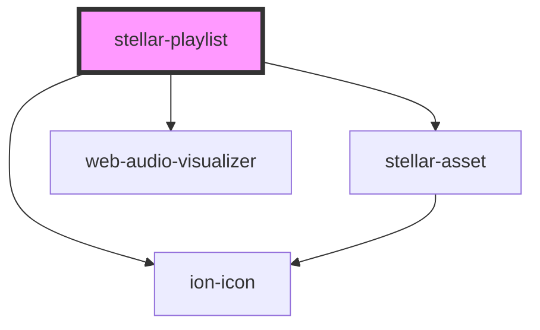

# stellar-playlist

<!-- Auto Generated Below -->

## Properties

| Property   | Attribute  | Description | Type                  | Default      |
| ---------- | ---------- | ----------- | --------------------- | ------------ |
| `artwork`  | `artwork`  |             | `boolean`             | `false`      |
| `autoplay` | `autoplay` |             | `boolean`             | `false`      |
| `dark`     | --         |             | `Boolean`             | `false`      |
| `playing`  | `playing`  |             | `boolean`             | `false`      |
| `playlist` | `playlist` |             | `string`              | `"show"`     |
| `remember` | `remember` |             | `boolean`             | `true`       |
| `view`     | `view`     |             | `"art" \| "playlist"` | `"playlist"` |

## Methods

### `next() => Promise<void>`

#### Returns

Type: `Promise<void>`

### `pause() => Promise<void>`

#### Returns

Type: `Promise<void>`

### `play() => Promise<void>`

#### Returns

Type: `Promise<void>`

### `prepare(element: any) => Promise<void>`

#### Returns

Type: `Promise<void>`

### `previous() => Promise<void>`

#### Returns

Type: `Promise<void>`

## Dependencies

### Depends on

- [stellar-asset](../../ui/asset)
- ion-icon
- [web-audio-visualizer](../../audio/web-audio-visualizer)

### Graph

----------------------------------------------

*Built with [StencilJS](https://stenciljs.com/)*
