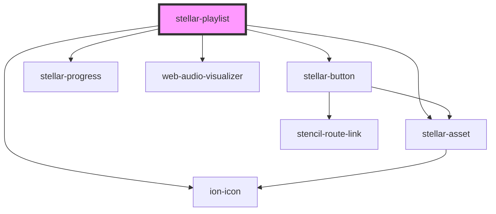

# stellar-playlist

<!-- Auto Generated Below -->

## Properties

| Property             | Attribute             | Description | Type                  | Default      |
| -------------------- | --------------------- | ----------- | --------------------- | ------------ |
| `artwork`            | `artwork`             |             | `boolean`             | `false`      |
| `autoplay`           | `autoplay`            |             | `boolean`             | `false`      |
| `load`               | `load`                |             | `boolean`             | `false`      |
| `loading`            | `loading`             |             | `boolean`             | `false`      |
| `name`               | `name`                |             | `string`              | `"Playlist"` |
| `playing`            | `playing`             |             | `boolean`             | `false`      |
| `playlist`           | `playlist`            |             | `"hide" \| "show"`    | `"show"`     |
| `remember`           | `remember`            |             | `boolean`             | `true`       |
| `view`               | `view`                |             | `"art" \| "playlist"` | `"playlist"` |
| `visualizationColor` | `visualization-color` |             | `string`              | `"gray"`     |

## Events

| Event        | Description | Type               |
| ------------ | ----------- | ------------------ |
| `load_songs` |             | `CustomEvent<any>` |

## Methods

### `next() => Promise<void>`

#### Returns

Type: `Promise<void>`

### `pause() => Promise<void>`

#### Returns

Type: `Promise<void>`

### `play(skipDefault?: boolean) => Promise<void>`

#### Returns

Type: `Promise<void>`

### `prepare(element: any) => Promise<void>`

#### Returns

Type: `Promise<void>`

### `previous() => Promise<void>`

#### Returns

Type: `Promise<void>`

## Dependencies

### Depends on

- [stellar-asset](../../ui/asset)
- ion-icon
- [stellar-button](../../forms/button)
- [stellar-progress](../../forms/progress)
- [web-audio-visualizer](../../audio/web-audio-visualizer)

### Graph

----------------------------------------------

*Built with [StencilJS](https://stenciljs.com/)*
