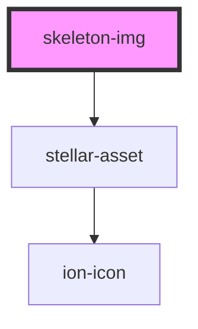

# skeleton-text

<!-- Auto Generated Below -->

## Usage

### Default

<skeleton-img></skeleton-img>

### Loading

<skeleton-img loading></skeleton-img>

### Theming

<stellar-grid>
	<skeleton-img loading class="theme-red"></skeleton-img>
	<skeleton-img loading class="theme-orange"></skeleton-img>
	<skeleton-img loading class="theme-yellow"></skeleton-img>
	<skeleton-img loading class="theme-lime"></skeleton-img>
	<skeleton-img loading class="theme-green"></skeleton-img>
	<skeleton-img loading class="theme-teal"></skeleton-img>
	<skeleton-img loading class="theme-cyan"></skeleton-img>
	<skeleton-img loading class="theme-blue"></skeleton-img>
	<skeleton-img loading class="theme-indigo"></skeleton-img>
	<skeleton-img loading class="theme-violet"></skeleton-img>
	<skeleton-img loading class="theme-fuchsia"></skeleton-img>
	<skeleton-img loading class="theme-pink"></skeleton-img>
	<skeleton-img loading class="theme-gray"></skeleton-img>
</stellar-grid>

## Properties

| Property  | Attribute | Description | Type      | Default |
| --------- | --------- | ----------- | --------- | ------- |
| `height`  | `height`  |             | `number`  | `300`   |
| `icon`    | `icon`    |             | `boolean` | `false` |
| `loading` | `loading` |             | `boolean` | `false` |
| `width`   | `width`   |             | `number`  | `600`   |

## Dependencies

### Depends on

- [stellar-asset](../../ui/asset)

### Graph

----------------------------------------------

*Built with [StencilJS](https://stenciljs.com/)*
