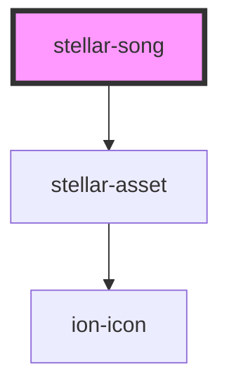

# stellar-song

<!-- Auto Generated Below -->

## Properties

| Property  | Attribute | Description | Type      | Default     |
| --------- | --------- | ----------- | --------- | ----------- |
| `artwork` | `artwork` |             | `boolean` | `undefined` |
| `playing` | `playing` |             | `boolean` | `undefined` |
| `src`     | `src`     |             | `string`  | `undefined` |

## Events

| Event         | Description | Type               |
| ------------- | ----------- | ------------------ |
| `loaded`      |             | `CustomEvent<any>` |
| `songChanged` |             | `CustomEvent<any>` |

## Methods

### `details() => Promise<{ 'title': string; 'album': string; 'genre': string; 'artist': string; 'picture': string; }>`

#### Returns

Type: `Promise<{ 'title': string; 'album': string; 'genre': string; 'artist': string; 'picture': string; }>`

### `getIndex() => Promise<number>`

#### Returns

Type: `Promise<number>`

### `load() => Promise<void>`

#### Returns

Type: `Promise<void>`

### `play() => Promise<void>`

#### Returns

Type: `Promise<void>`

### `preload() => Promise<void>`

#### Returns

Type: `Promise<void>`

### `setIndex(value: any) => Promise<void>`

#### Returns

Type: `Promise<void>`

### `switching() => Promise<void>`

#### Returns

Type: `Promise<void>`

## Dependencies

### Depends on

- [stellar-asset](../../ui/asset)

### Graph

----------------------------------------------

*Built with [StencilJS](https://stenciljs.com/)*
