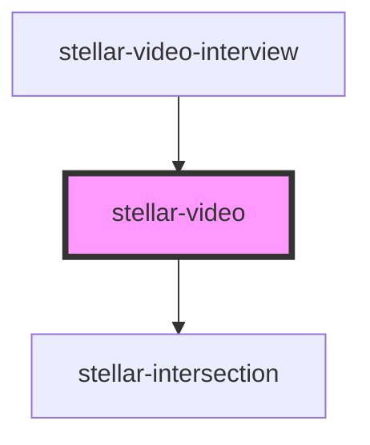

# stellar-video

<!-- Auto Generated Below -->

## Properties

| Property      | Attribute       | Description | Type      | Default     |
| ------------- | --------------- | ----------- | --------- | ----------- |
| `autoplay`    | `autoplay`      |             | `boolean` | `false`     |
| `controls`    | `controls`      |             | `boolean` | `true`      |
| `height`      | `height`        |             | `number`  | `undefined` |
| `muted`       | `muted`         |             | `boolean` | `false`     |
| `overlay`     | `overlay`       |             | `boolean` | `undefined` |
| `playing`     | `playing`       |             | `boolean` | `false`     |
| `playsinline` | `playsinline`   |             | `boolean` | `false`     |
| `poster`      | `poster`        |             | `string`  | `undefined` |
| `preload`     | `preload`       |             | `string`  | `"auto"`    |
| `trackInView` | `track-in-view` |             | `boolean` | `true`      |
| `width`       | `width`         |             | `number`  | `undefined` |

## Events

| Event    | Description | Type               |
| -------- | ----------- | ------------------ |
| `loaded` |             | `CustomEvent<any>` |
| `paused` |             | `CustomEvent<any>` |
| `played` |             | `CustomEvent<any>` |
| `update` |             | `CustomEvent<any>` |

## Methods

### `getDuration() => Promise<number>`

#### Returns

Type: `Promise<number>`

### `pause() => Promise<void>`

#### Returns

Type: `Promise<void>`

### `play() => Promise<void>`

#### Returns

Type: `Promise<void>`

### `skipTo(time: any) => Promise<void>`

#### Returns

Type: `Promise<void>`

### `stop() => Promise<void>`

#### Returns

Type: `Promise<void>`

### `toggle() => Promise<void>`

#### Returns

Type: `Promise<void>`

### `videoElement() => Promise<HTMLVideoElement>`

#### Returns

Type: `Promise<HTMLVideoElement>`

## Dependencies

### Used by

 - [stellar-video-interview](../video-interview)

### Depends on

- [stellar-intersection](../../helpers/intersection)

### Graph

----------------------------------------------

*Built with [StencilJS](https://stenciljs.com/)*
