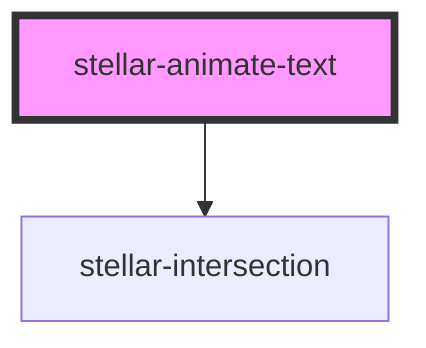

# stellar-animate-text

<!-- Auto Generated Below -->

## Properties

| Property   | Attribute  | Description | Type      | Default       |
| ---------- | ---------- | ----------- | --------- | ------------- |
| `delay`    | `delay`    |             | `number`  | `50`          |
| `duration` | `duration` |             | `number`  | `1000`        |
| `method`   | `method`   |             | `string`  | `"lettering"` |
| `phrase`   | `phrase`   |             | `boolean` | `false`       |
| `words`    | `words`    |             | `boolean` | `false`       |

## Methods

### `in() => Promise<void>`

#### Returns

Type: `Promise<void>`

### `out() => Promise<void>`

#### Returns

Type: `Promise<void>`

## Dependencies

### Depends on

- [stellar-intersection](../../helpers/intersection)

### Graph

----------------------------------------------

*Built with [StencilJS](https://stenciljs.com/)*
