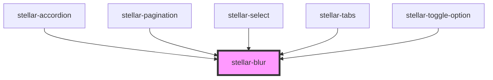

# stellar-blur

<!-- Auto Generated Below -->

## Usage

### Animate-text

<copy-wrap align="center">
	<stellar-animate-text method="lettering">
		<h1>Stellar!</h1>
		<h3 alt>A Beautiful, Complete Design System</h3>
	</stellar-animate-text>
</copy-wrap>

### Default

<stellar-blur class="example mb4 db">
	<copy-wrap>
		<h1>Awesome~</h1>
		<h2 alt>Change the values below to see the blurring changes.</h2>
	</copy-wrap>
</stellar-blur>
<stellar-grid cols="1" class="theme-gray">
	<stellar-input type="number" max="50" min="0" placeholder="Vertical" onChange="document.querySelector('stellar-blur.example').vertical = this.value;"></stellar-input>
	<stellar-input type="number" max="50" min="0" placeholder="Horizontal" onChange="document.querySelector('stellar-blur.example').horizontal = this.value;"></stellar-input>
</stellar-grid>

## Properties

| Property     | Attribute    | Description | Type     | Default |
| ------------ | ------------ | ----------- | -------- | ------- |
| `horizontal` | `horizontal` |             | `number` | `0`     |
| `vertical`   | `vertical`   |             | `number` | `0`     |

## Dependencies

### Used by

 - [stellar-accordion](../../ui/accordion)
 - [stellar-pagination](../../ui/pagination)
 - [stellar-select](../../forms/select)
 - [stellar-tabs](../../ui/tabs)
 - [stellar-toggle-option](../../forms/toggle-option)

### Graph

----------------------------------------------

*Built with [StencilJS](https://stenciljs.com/)*
