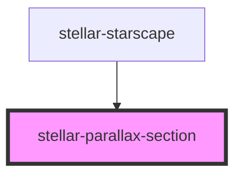

# stellar-parallax-section

<!-- Auto Generated Below -->

## Properties

| Property     | Attribute    | Description | Type     | Default     |
| ------------ | ------------ | ----------- | -------- | ----------- |
| `layer`      | `layer`      |             | `number` | `1`         |
| `percentage` | `percentage` |             | `number` | `undefined` |
| `speed`      | `speed`      |             | `number` | `1`         |

## Dependencies

### Used by

 - [stellar-starscape](../../helpers/starscape)

### Graph

----------------------------------------------

*Built with [StencilJS](https://stenciljs.com/)*
