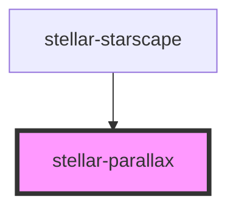

# stellar-parallax

<!-- Auto Generated Below -->

## Usage

### Default

<stellar-parallax>
	<stellar-parallax-section speed="0">
		<stellar-starscape></stellar-starscape>
	</stellar-parallax-section>
	<stellar-parallax-section speed="-4" class="h6 ml6 self-start">
		<stellar-asset name="airplane" language="md-" class="fs-massive theme-base5"></stellar-asset>
	</stellar-parallax-section>
	<stellar-parallax-section speed="-10" class="h6 mr6 left--2">
		<stellar-asset name="airplane" language="md-" class="fs-massive theme-complement5"></stellar-asset>
	</stellar-parallax-section>
	<stellar-parallax-section speed="10" class="h6 mr6 mb6 right--2">
		<stellar-asset name="airplane" language="md-" class="fs-massive theme-base5"></stellar-asset>
	</stellar-parallax-section>
	<stellar-parallax-section speed="4" class="h6 ml4 mt6">
		<stellar-asset name="airplane" language="md-" class="fs-massive theme-complement5"></stellar-asset>
	</stellar-parallax-section>
</stellar-parallax>

## Properties

| Property     | Attribute    | Description | Type      | Default |
| ------------ | ------------ | ----------- | --------- | ------- |
| `center`     | `center`     |             | `boolean` | `false` |
| `horizontal` | `horizontal` |             | `boolean` | `false` |

## Dependencies

### Used by

 - [stellar-starscape](../../helpers/starscape)

### Graph

----------------------------------------------

*Built with [StencilJS](https://stenciljs.com/)*
