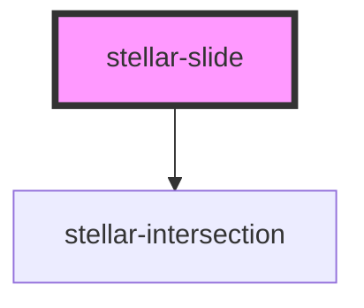

# ion-slide

The Slide component is a child component of [Slides](../Slides). The template
should be written as `ion-slide`. Any slide content should be written
in this component and it should be used in conjunction with [Slides](../Slides).

See the [Slides API Docs](../Slides) for more usage information.

<!-- Auto Generated Below -->

## Properties

| Property  | Attribute  | Description | Type     | Default     |
| --------- | ---------- | ----------- | -------- | ----------- |
| `slideId` | `slide-id` |             | `number` | `undefined` |
| `width`   | `width`    |             | `string` | `"auto"`    |

## Events

| Event      | Description | Type               |
| ---------- | ----------- | ------------------ |
| `switched` |             | `CustomEvent<any>` |

## Dependencies

### Depends on

- [stellar-intersection](../../helpers/intersection)

### Graph

----------------------------------------------

*Built with [StencilJS](https://stenciljs.com/)*
