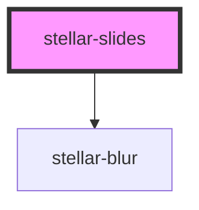

# stellar-slides

The Slides component is a multi-section container. Each section can be swiped
or dragged between. It contains any number of [Slide](../Slide) components.

Adopted from Swiper.js:
The most modern mobile touch slider and framework with hardware accelerated transitions.

http://www.idangero.us/swiper/

Copyright 2016, Vladimir Kharlampidi
The iDangero.us
http://www.idangero.us/

Licensed under MIT

<!-- Auto Generated Below -->

## Usage

### Coverflow

<stellar-slides id="example-slides" slides-per-view="3" effect="coverflow">
  <stellar-slide>
    <stellar-card>
      <copy-wrap>
        <h1 class="flex white items-center"><stellar-asset name="rocket" class="db mr4 mt1"></stellar-asset>Hello!</h1>
      </copy-wrap>
    <stellar-starscape></stellar-starscape>
    </stellar-card>
  </stellar-slide>
  <stellar-slide>
    <stellar-card>
      <copy-wrap>
        <h1 class="flex white items-center"><stellar-avatar name="William M. Riley" shape="star" class="db mr4 mt1"></stellar-avatar>Hello!</h1>
      </copy-wrap>
    <stellar-starscape></stellar-starscape>
    </stellar-card>
  </stellar-slide>
  <stellar-slide>
    <stellar-card>
      <copy-wrap>
        <h1 class="flex white items-center"><stellar-asset name="rocket" class="db mr4 mt1"></stellar-asset>Hello!</h1>
      </copy-wrap>
    <stellar-starscape></stellar-starscape>
    </stellar-card>
  </stellar-slide>
  <stellar-slide>
    <stellar-card>
      <copy-wrap>
        <h1 class="flex white items-center"><stellar-asset name="rocket" class="db mr4 mt1"></stellar-asset>Hello!</h1>
      </copy-wrap>
    <stellar-starscape></stellar-starscape>
    </stellar-card>
  </stellar-slide>
  <stellar-slide>
    <stellar-card>
      <copy-wrap>
        <h1 class="flex white items-center"><stellar-asset name="rocket" class="db mr4 mt1"></stellar-asset>Hello!</h1>
      </copy-wrap>
    <stellar-starscape></stellar-starscape>
    </stellar-card>
  </stellar-slide>
  <stellar-slide>
    <stellar-card>
      <copy-wrap>
        <h1 class="flex white items-center"><stellar-asset name="rocket" class="db mr4 mt1"></stellar-asset>Hello!</h1>
      </copy-wrap>
    <stellar-starscape></stellar-starscape>
    </stellar-card>
  </stellar-slide>
</stellar-slides>

### Default

<stellar-slides id="example-slides">
  <stellar-slide>
    <stellar-card>
      <copy-wrap>
        <h1 class="flex white items-center"><stellar-asset name="rocket" class="db mr4 mt1"></stellar-asset>Hello!</h1>
      </copy-wrap>
    <stellar-starscape></stellar-starscape>
    </stellar-card>
  </stellar-slide>
  <stellar-slide>
    <stellar-card>
      <copy-wrap>
        <h1 class="flex white items-center"><stellar-avatar name="William M. Riley" shape="star" class="db mr4 mt1"></stellar-avatar>Hello!</h1>
      </copy-wrap>
    <stellar-starscape></stellar-starscape>
    </stellar-card>
  </stellar-slide>
  <stellar-slide>
    <stellar-card>
      <copy-wrap>
        <h1 class="flex white items-center"><stellar-asset name="rocket" class="db mr4 mt1"></stellar-asset>Hello!</h1>
      </copy-wrap>
    <stellar-starscape></stellar-starscape>
    </stellar-card>
  </stellar-slide>
  <stellar-slide>
    <stellar-card>
      <copy-wrap>
        <h1 class="flex white items-center"><stellar-asset name="rocket" class="db mr4 mt1"></stellar-asset>Hello!</h1>
      </copy-wrap>
    <stellar-starscape></stellar-starscape>
    </stellar-card>
  </stellar-slide>
  <stellar-slide>
    <stellar-card>
      <copy-wrap>
        <h1 class="flex white items-center"><stellar-asset name="rocket" class="db mr4 mt1"></stellar-asset>Hello!</h1>
      </copy-wrap>
    <stellar-starscape></stellar-starscape>
    </stellar-card>
  </stellar-slide>
  <stellar-slide>
    <stellar-card>
      <copy-wrap>
        <h1 class="flex white items-center"><stellar-asset name="rocket" class="db mr4 mt1"></stellar-asset>Hello!</h1>
      </copy-wrap>
    <stellar-starscape></stellar-starscape>
    </stellar-card>
  </stellar-slide>
</stellar-slides>

### Multiple items

<stellar-slides id="example-slides" slides-per-view="3">
  <stellar-slide>
    <stellar-card>
      <copy-wrap>
        <h1 class="flex white items-center"><stellar-asset name="rocket" class="db mr4 mt1"></stellar-asset>Hello!</h1>
      </copy-wrap>
    <stellar-starscape></stellar-starscape>
    </stellar-card>
  </stellar-slide>
  <stellar-slide>
    <stellar-card>
      <copy-wrap>
        <h1 class="flex white items-center"><stellar-avatar name="William M. Riley" shape="star" class="db mr4 mt1"></stellar-avatar>Hello!</h1>
      </copy-wrap>
    <stellar-starscape></stellar-starscape>
    </stellar-card>
  </stellar-slide>
  <stellar-slide>
    <stellar-card>
      <copy-wrap>
        <h1 class="flex white items-center"><stellar-asset name="rocket" class="db mr4 mt1"></stellar-asset>Hello!</h1>
      </copy-wrap>
    <stellar-starscape></stellar-starscape>
    </stellar-card>
  </stellar-slide>
  <stellar-slide>
    <stellar-card>
      <copy-wrap>
        <h1 class="flex white items-center"><stellar-asset name="rocket" class="db mr4 mt1"></stellar-asset>Hello!</h1>
      </copy-wrap>
    <stellar-starscape></stellar-starscape>
    </stellar-card>
  </stellar-slide>
  <stellar-slide>
    <stellar-card>
      <copy-wrap>
        <h1 class="flex white items-center"><stellar-asset name="rocket" class="db mr4 mt1"></stellar-asset>Hello!</h1>
      </copy-wrap>
    <stellar-starscape></stellar-starscape>
    </stellar-card>
  </stellar-slide>
  <stellar-slide>
    <stellar-card>
      <copy-wrap>
        <h1 class="flex white items-center"><stellar-asset name="rocket" class="db mr4 mt1"></stellar-asset>Hello!</h1>
      </copy-wrap>
    <stellar-starscape></stellar-starscape>
    </stellar-card>
  </stellar-slide>
</stellar-slides>

### Slide

<stellar-slides id="example-slides" effect="slide">
  <stellar-slide>
    <stellar-card>
      <copy-wrap>
        <h1 class="flex white items-center"><stellar-asset name="rocket" class="db mr4 mt1"></stellar-asset>Hello!</h1>
      </copy-wrap>
    <stellar-starscape></stellar-starscape>
    </stellar-card>
  </stellar-slide>
  <stellar-slide>
    <stellar-card>
      <copy-wrap>
        <h1 class="flex white items-center"><stellar-avatar name="William M. Riley" shape="star" class="db mr4 mt1"></stellar-avatar>Hello!</h1>
      </copy-wrap>
    <stellar-starscape></stellar-starscape>
    </stellar-card>
  </stellar-slide>
  <stellar-slide>
    <stellar-card>
      <copy-wrap>
        <h1 class="flex white items-center"><stellar-asset name="rocket" class="db mr4 mt1"></stellar-asset>Hello!</h1>
      </copy-wrap>
    <stellar-starscape></stellar-starscape>
    </stellar-card>
  </stellar-slide>
  <stellar-slide>
    <stellar-card>
      <copy-wrap>
        <h1 class="flex white items-center"><stellar-asset name="rocket" class="db mr4 mt1"></stellar-asset>Hello!</h1>
      </copy-wrap>
    <stellar-starscape></stellar-starscape>
    </stellar-card>
  </stellar-slide>
  <stellar-slide>
    <stellar-card>
      <copy-wrap>
        <h1 class="flex white items-center"><stellar-asset name="rocket" class="db mr4 mt1"></stellar-asset>Hello!</h1>
      </copy-wrap>
    <stellar-starscape></stellar-starscape>
    </stellar-card>
  </stellar-slide>
  <stellar-slide>
    <stellar-card>
      <copy-wrap>
        <h1 class="flex white items-center"><stellar-asset name="rocket" class="db mr4 mt1"></stellar-asset>Hello!</h1>
      </copy-wrap>
    <stellar-starscape></stellar-starscape>
    </stellar-card>
  </stellar-slide>
</stellar-slides>

## Properties

| Property                | Attribute                 | Description                                                                                  | Type                                                   | Default        |
| ----------------------- | ------------------------- | -------------------------------------------------------------------------------------------- | ------------------------------------------------------ | -------------- |
| `autoHeight`            | `auto-height`             |                                                                                              | `boolean`                                              | `false`        |
| `blurring`              | `blurring`                |                                                                                              | `boolean`                                              | `true`         |
| `centeredSlides`        | `centered-slides`         |                                                                                              | `boolean`                                              | `true`         |
| `direction`             | `direction`               |                                                                                              | `"horizontal" \| "vertical"`                           | `"horizontal"` |
| `effect`                | `effect`                  |                                                                                              | `"coverflow" \| "cube" \| "fade" \| "flip" \| "slide"` | `"slide"`      |
| `initialSlide`          | `initial-slide`           |                                                                                              | `number`                                               | `0`            |
| `loop`                  | `loop`                    |                                                                                              | `boolean`                                              | `false`        |
| `nested`                | `nested`                  |                                                                                              | `boolean`                                              | `false`        |
| `options`               | `options`                 | Options to pass to the swiper instance. See http://idangero.us/swiper/api/ for valid options | `any`                                                  | `undefined`    |
| `pager`                 | `pager`                   | Show or hide the pager                                                                       | `boolean`                                              | `true`         |
| `pagination`            | `pagination`              |                                                                                              | `boolean`                                              | `false`        |
| `slidesPerView`         | `slides-per-view`         |                                                                                              | `number`                                               | `3`            |
| `spaceBetween`          | `space-between`           |                                                                                              | `number`                                               | `30`           |
| `speed`                 | `speed`                   |                                                                                              | `number`                                               | `300`          |
| `watchSlidesProgress`   | `watch-slides-progress`   |                                                                                              | `boolean`                                              | `false`        |
| `watchSlidesVisibility` | `watch-slides-visibility` |                                                                                              | `boolean`                                              | `false`        |

## Events

| Event                     | Description                                         | Type               |
| ------------------------- | --------------------------------------------------- | ------------------ |
| `ionSlideDidChange`       | Emitted after the active slide has changed.         | `CustomEvent<any>` |
| `ionSlideDrag`            | Emitted when the slider is actively being moved.    | `CustomEvent<any>` |
| `ionSlideNextEnd`         | Emitted when the next slide has ended.              | `CustomEvent<any>` |
| `ionSlideNextStart`       | Emitted when the next slide has started.            | `CustomEvent<any>` |
| `ionSlidePrevEnd`         | Emitted when the previous slide has ended.          | `CustomEvent<any>` |
| `ionSlidePrevStart`       | Emitted when the previous slide has started.        | `CustomEvent<any>` |
| `ionSlideReachEnd`        | Emitted when the slider is at the last slide.       | `CustomEvent<any>` |
| `ionSlideReachStart`      | Emitted when the slider is at its initial position. | `CustomEvent<any>` |
| `ionSlideTouchEnd`        | Emitted when the user releases the touch.           | `CustomEvent<any>` |
| `ionSlideTouchStart`      | Emitted when the user first touches the slider.     | `CustomEvent<any>` |
| `ionSlideTransitionEnd`   | Emitted when the slide transition has ended.        | `CustomEvent<any>` |
| `ionSlideTransitionStart` | Emitted when the slide transition has started.      | `CustomEvent<any>` |
| `ionSlideWillChange`      | Emitted before the active slide has changed.        | `CustomEvent<any>` |

## Methods

### `getActiveIndex() => Promise<number>`

Get the index of the active slide.

#### Returns

Type: `Promise<number>`

### `getPreviousIndex() => Promise<number>`

Get the index of the previous slide.

#### Returns

Type: `Promise<number>`

### `instance() => Promise<any>`

#### Returns

Type: `Promise<any>`

### `isBeginning() => Promise<boolean>`

Get whether or not the current slide is the first slide.

#### Returns

Type: `Promise<boolean>`

### `isEnd() => Promise<boolean>`

Get whether or not the current slide is the last slide.

#### Returns

Type: `Promise<boolean>`

### `length() => Promise<number>`

Get the total number of slides.

#### Returns

Type: `Promise<number>`

### `lockSwipeToNext(shouldLockSwipeToNext: boolean) => Promise<any>`

Lock or unlock the ability to slide to the next slides.

#### Returns

Type: `Promise<any>`

### `lockSwipeToPrev(shouldLockSwipeToPrev: boolean) => Promise<any>`

Lock or unlock the ability to slide to the previous slides.

#### Returns

Type: `Promise<any>`

### `lockSwipes(shouldLockSwipes: boolean) => Promise<any>`

Lock or unlock the ability to slide to change slides.

#### Returns

Type: `Promise<any>`

### `slideNext(speed?: number, runCallbacks?: boolean) => Promise<void>`

Transition to the next slide.

#### Returns

Type: `Promise<void>`

### `slidePrev(speed?: number, runCallbacks?: boolean) => Promise<void>`

Transition to the previous slide.

#### Returns

Type: `Promise<void>`

### `slideTo(index: number, speed?: number, runCallbacks?: boolean) => Promise<void>`

Transition to the specified slide.

#### Returns

Type: `Promise<void>`

### `startAutoplay() => Promise<void>`

Start auto play.

#### Returns

Type: `Promise<void>`

### `stopAutoplay() => Promise<void>`

Stop auto play.

#### Returns

Type: `Promise<void>`

### `update() => Promise<void>`

Update the underlying slider implementation. Call this if you've added or removed
child slides.

#### Returns

Type: `Promise<void>`

## Dependencies

### Depends on

- [stellar-blur](../blur)

### Graph

----------------------------------------------

*Built with [StencilJS](https://stenciljs.com/)*
