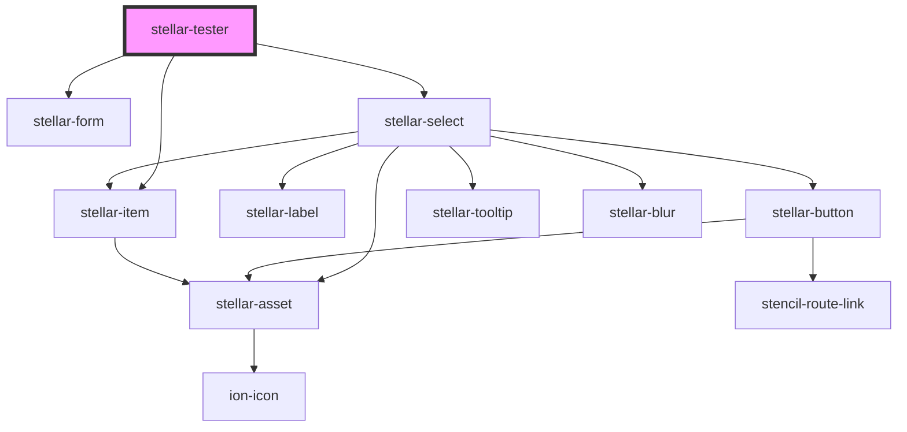

# stellar-tester

<!-- Auto Generated Below -->

## Methods

### `new_options() => Promise<void>`

#### Returns

Type: `Promise<void>`

## Dependencies

### Depends on

- [stellar-form](../forms/form)
- [stellar-select](../forms/select)
- [stellar-item](../forms/item)

### Graph

----------------------------------------------

*Built with [StencilJS](https://stenciljs.com/)*
