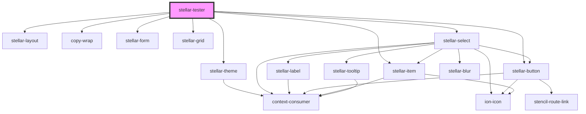

# stellar-tester

<!-- Auto Generated Below -->

## Dependencies

### Depends on

- [stellar-layout](../ui/layout)
- [stellar-theme](../helpers/theme)
- [copy-wrap](../ui/copy-wrap)
- [stellar-form](../forms/form)
- [stellar-grid](../ui/grid)
- [stellar-select](../forms/select)
- [stellar-item](../forms/item)
- [stellar-button](../forms/button)

### Graph

----------------------------------------------

*Built with [StencilJS](https://stenciljs.com/)*
