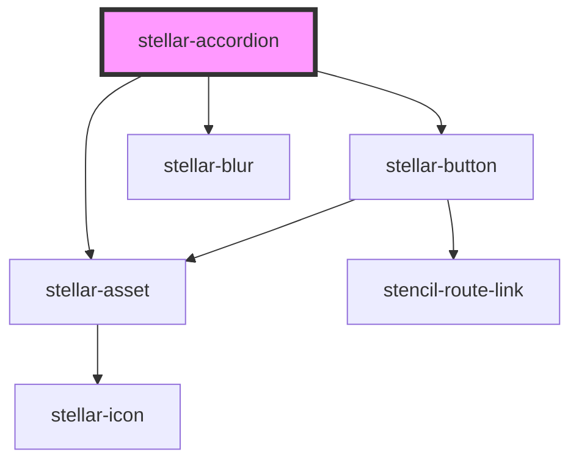

# stellar-accordian

<!-- Auto Generated Below -->

## Usage

### Default

<stellar-accordion>
	
Title <stellar-tag size='tiny'>New</stellar-tag>

	<h1>Content!</h1>
	<h2>Hello!</h2>
</stellar-accordion>

## Properties

| Property | Attribute | Description | Type      | Default          |
| -------- | --------- | ----------- | --------- | ---------------- |
| `label`  | `label`   |             | `string`  | `"More Details"` |
| `name`   | `name`    |             | `string`  | `"accordion"`    |
| `open`   | `open`    |             | `boolean` | `false`          |
| `tight`  | `tight`   |             | `boolean` | `false`          |

## Methods

### `refresh() => Promise<void>`

#### Returns

Type: `Promise<void>`

## Dependencies

### Depends on

- [stellar-button](../../forms/button)
- [stellar-asset](../asset)
- [stellar-blur](../../motion/blur)

### Graph

----------------------------------------------

*Built with [StencilJS](https://stenciljs.com/)*
