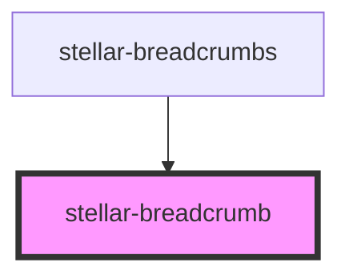

# stellar-breadcrumb

<!-- Auto Generated Below -->

## Properties

| Property   | Attribute  | Description | Type                | Default             |
| ---------- | ---------- | ----------- | ------------------- | ------------------- |
| `color`    | `color`    |             | `string`            | `undefined`         |
| `disabled` | `disabled` |             | `boolean`           | `false`             |
| `first`    | `first`    |             | `boolean`           | `undefined`         |
| `href`     | `href`     |             | `string`            | `"/"`               |
| `label`    | `label`    |             | `string`            | `"Breadcrumb link"` |
| `last`     | `last`     |             | `boolean`           | `undefined`         |
| `tag`      | `tag`      |             | `"link" \| "route"` | `"link"`            |
| `target`   | `target`   |             | `string`            | `"_self"`           |

## Dependencies

### Used by

 - [stellar-breadcrumbs](../breadcrumbs)

### Graph

----------------------------------------------

*Built with [StencilJS](https://stenciljs.com/)*
