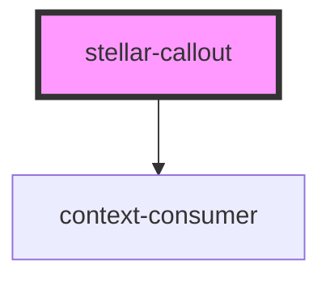

# stellar-asset

<!-- Auto Generated Below -->

## Usage

### Default

<stellar-callout>
  
Hello! <a href="#">Awesome!</a>

</stellar-callout>

### States

<stellar-callout type="alert">
	
Hello! <a href="#">Awesome!</a>

</stellar-callout>

 

<stellar-callout type="error">
	
Hello! <a href="#">Awesome!</a>

</stellar-callout>

 

<stellar-callout type="info">

Hello! <a href="#">Awesome!</a>

</stellar-callout>

 

<stellar-callout type="success">
	
Hello! <a href="#">Awesome!</a>

</stellar-callout>

## Properties

| Property | Attribute | Description | Type                                                     | Default     |
| -------- | --------- | ----------- | -------------------------------------------------------- | ----------- |
| `dark`   | `dark`    |             | `boolean`                                                | `false`     |
| `type`   | `type`    |             | `"alert" or "default" or "error" or "info" or "success"` | `"default"` |

## Dependencies

### Depends on

- context-consumer

### Graph

----------------------------------------------

*Built with [StencilJS](https://stenciljs.com/)*
